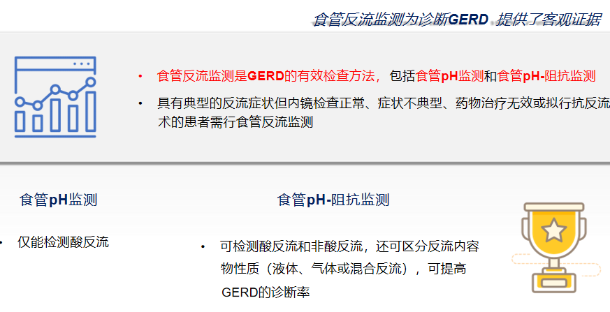
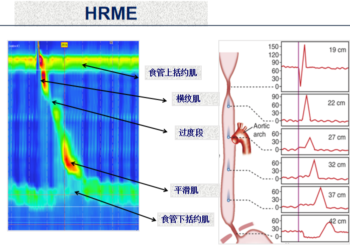
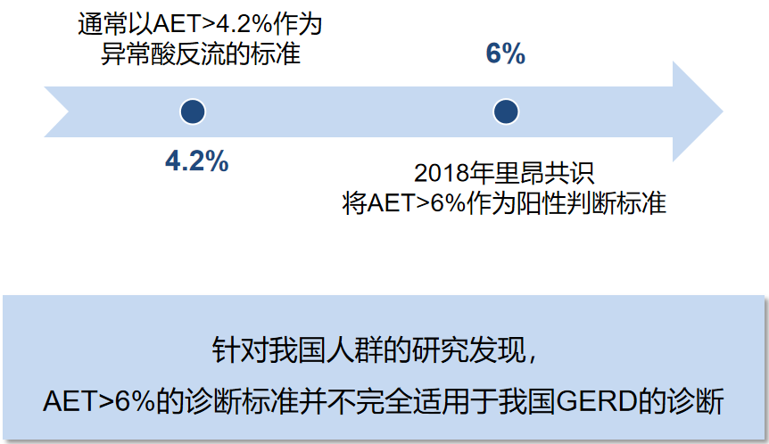
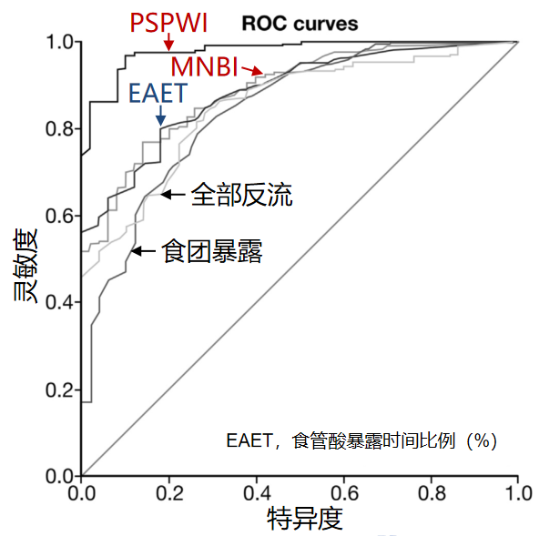
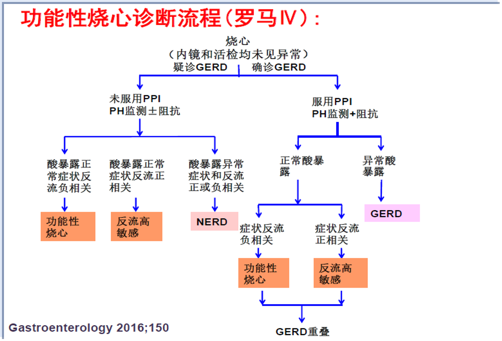
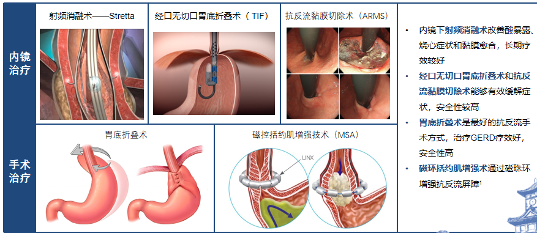

---
aliases:
  - GERD
---
## 诊断
#### 主观诊断
- 典型症状拟诊
- 反流问卷辅助：胃食管反流病问卷（GerdQ）是诊断及评估 GERD 最简单有效的工具。问卷设计基于患者就诊前1周内的症状，诊断精确性高。
[Open: Pasted image 20260901195516.png](attachments/8e154dcc613567e05b0eb7e61d0c5423_MD5.jpg)

- ![[PPI试验性治疗]]
#### 客观诊断
- 1.内镜检查：确定类型，活检，色素及放大内镜，治疗
<mark style="background-color: #705A16; color: white">LA分级</mark>为RE在内镜下表现和严重程度分级
洛杉矶分级法（Los Angeles， 1994年）
> 正常：食管黏膜没有破损；
> A级：一个或一个以上食管黏膜破损，长度小于5mm；
> B级：一个或一个以上食管黏膜破损，长度大于5mm，但没有融合性病变；
> C级：黏膜破损有融合，但小于75%的食管周径；
> D级：黏膜破损融合，至少达到75%的食管周径；

- 2.食管反流监测：GERD可导致食管溃疡、狭窄和食管腺癌等食管并发症；我国[Barrett 食管](Barrett%20食管.md)患者近一半表现为GERD的非典型症状
> <mark style="background-color: #705A16; color: white">食管pH-阻抗监测</mark>是目前诊断GERD的“金标准”
> [Open: Pasted image 20260912164202.png](attachments/542e665c12b8a4f8c7b0c006572e9098_MD5.jpg)

> 1️⃣24 h食管pH检测：确定反流存在的界限点。
> pH<4的时间称为反流时间，pH＜4的时间＞4%；
> ——2018里昂共识

> 2️⃣多通道腔内阻抗技术（Multichannel intraluminal impedance，MII）于上世纪80年代后期诞生于德国，其应用于胃食管监测的工作原理为：通过记录食管腔内食团通过所引起的阻抗值变化来反映食团的性质和运动情况。
> 联合阻抗和pH监测能克服单独使用pH监测所不能识别的pH≥4的反流，从而全面评估胃食管反流事件，提高诊断GERD的敏感性和特异性，对GERD的治疗有重要的指导意义。

- 3.食管<mark style="background-color: #705A16; color: white">高分辨率测压</mark>（High Resolution Manometry，HRM）
> 食管高分辨率测压可检测GERD患者的食管动力状态，并作为抗反流内镜下治疗和外科手术前的常规评估手段。
> （推荐级别：A+，62.1%；A，34.5%。证据等级：中等质量）[343Open: Pasted image 20260914091346.png](attachments/d46c46cbabd9d128e8e2ff0f8ddd3313_MD5.jpg)

- 4.食管吞钡X线检查
> 敏感性不高
> 排除食管癌、贲门失弛缓症等
> 观察食管的运动情况，可注意到有无反流征象

- 5.新技术：食管黏膜阻抗技术和EndoFlip技术
#### 诊断标准
符合以下任何一条可确诊GERD:
- 具有典型的<mark style="background-color: #1A4F10; color: white">反流症状</mark>（烧心和/或反酸），抑酸剂试验性治疗有效；
- 上消化道<mark style="background-color: #1A4F10; color: white">内镜</mark>检查提示B级及以上RE、反流性狭窄或BE（<mark style="background-color: #1A4F10; color: white">病理</mark>证实）；
- 非典型上消化道症状，上消化道内镜检查未见食管黏膜破损或LA-A级食管炎，<mark style="background-color: #1A4F10; color: white">食管反流监测</mark>提示存在病理性反流（<mark style="background-color: #1A4F10; color: white">AET </mark>4.2%）。
##### 主要指标
！！！食管反流监测的主要指标是<mark style="background-color: #1A4F10; color: white">AET</mark>，<mark style="background-color: #1A4F10; color: white">PSPWI和MNBI</mark>是辅助诊断的新指标
1）食管反流监测的主要指标为酸暴露时间百分比（AET），定义为24 h内食管pH值<4的时间百分比
[Open: Pasted image 20260914082918.png](attachments/b1b9b550bdf0aff7005a9ddc263847ce_MD5.jpg)

反流后吞咽诱导蠕动波指数（PSPWI）和夜间基线阻抗（MNBI）能够有效区分GERD患者和健康受试者
[Open: Pasted image 20260914083000.png](attachments/de2f6932cff3bd39667521f3978b3046_MD5.jpg)

##### 鉴别诊断
###### 烧心的鉴别诊断
---功能性烧心（functionalheartburn， FH）
[354Open: Pasted image 20260914091829.png](attachments/66679bbf98488aaa934e2bed0e7ea401_MD5.jpg)

###### 胸痛的鉴别诊断
---非心源性胸痛（non-cardiac chest  pain, NCCP）

---
- GEJ 是 GERD 发生的初始部位，也是导致反流的最主要的解剖部位
LES：下食管括约肌； 
TLESR：下食管括约肌一过性松弛；  
GEJ:胃食管交界区

- 汪忠镐院士自2007年提出了“胃食管喉 气管综合征”的概念，之后提出胃食管气道反流性疾病（gastroesophageal airway reflux disease，GARD）。

---
## 症状
<mark style="background-color: #1A4F10; color: white">烧心和反流</mark>是GERD最常见的典型症状。
不典型症状中，[胸痛](胸痛.md)患者需先排除心脏因素后才能进行GERD评估
#### 食管症状
###### 症状综合征
典型反流综合征
反流胸痛综合征

###### 伴食管损伤的综合征
反流性食管炎
反流性狭窄
[Barrett 食管](Barrett%20食管.md)
食管腺癌

#### 食管外症状
###### 已证实相关
反流性咳嗽综合征
反流性喉炎综合征
反流性哮喘综合征
反流性蛀牙综合征
###### 可能相关
咽炎
鼻窦炎
特发性肺纤维化
复发性中耳炎

---
## 分类
#### 内镜下分类
两种类型相对独立，相互之间不转化或很少转化
###### 非糜烂性反流病NERD
60~70%中国人
###### 糜烂性食管炎EE erosive esophagitis
[Barrett 食管](Barrett%20食管.md)
合并食管狭窄、溃疡和消化道出血

## Risk factors
年龄：老年人EE检出率高于青年人；
性别：男性 GERD 患者比例明显高于女性；
肥胖及生活方式：肥胖、高脂辛辣饮食、吸烟、饮酒、喝浓茶、咖啡、可乐等碳酸饮料、长期便秘等因素与GERD的发生呈正相关，而体育锻炼和高纤维饮食可能为GERD的保护因素。

---
## 治疗
#### 生活方式调整
基础治疗手段，包括减肥、戒烟、抬高床头等
#### 药物治疗
- 抑酸药物 PCAB, PPI, H2RA。拉生类，拉唑类，替丁之类
- 抗酸药物（胃舒平，硫糖铝，铝碳酸镁）
- 黏膜保护剂（替普瑞酮，膜固思达，麦滋林-s颗粒，殊奇）
- 促动力药物：多巴胺受体拮抗剂（多潘立酮）、5-羟色胺受体激动剂（莫沙必利、伊托必利及替加色罗）和胃动素受体激动剂（红霉素）等
- 降低TLESR药物：γ-氨基丁酸β受体激动剂（巴氯芬）和亲代谢谷氨酸盐受体5拮抗剂
> PPI或P-CAB是治疗GERD的首选药物，单剂量治疗无效可改用双倍剂量，一种抑酸剂无效可尝试换用另一种。疗程为4~8周。
> （推荐级别：A+，58.6%；A，27.6%。证据等级：中等质量)

> 维持治疗方法包括按需治疗和长期治疗。抑酸剂初始治疗有效的NERD和轻度食管炎（洛杉矶分级为A和B级）患者可采用按需治疗，PPI或P-CAB为首选药物。
> （推荐级别：A+，63.3%；A，30.0%。证据等级：高质量）

> PPI或P-CAB停药后症状复发、重度食管炎（洛杉矶分级为C和D级）患者通常需要长期维持治疗。
> （推荐级别：A+，80.0%；A，13.3%。证据等级：中等质量)

维持治疗 (PPI/P-CAB)
1. 按需治疗
→初治有效NERD
→轻度食管炎 (LA A/B)
2. 长期维持
→停药后复发者
→重度食管炎 (LA C/D)

> 抗酸剂可快速缓解反流症状
> 更新：取消抗酸剂可用于维持治疗的推荐，明确用于GERD对症治疗，不主张长期使用
> 促动力药联合抑酸药物对缓解GERD患者的症状可能有效
> 更新：日本和欧洲指南不推荐单独使用，美国指南明确指出不推荐使用
> ➡️抗酸剂仅限短期使用，促动力药需联合抑酸药物用于改善症状

| 抗动力药种类                 | 常用药物    |
| ---------------------- | ------- |
| 多巴胺D2受体拮抗剂             | 甲氧氯普胺   |
| 胃动素受体激动剂               | 红霉素和类似物 |
| 外周性多巴胺D2受体拮抗剂          | 多潘立酮    |
| 选择性 5-羟色胺4受体激动剂        | 莫沙必利    |
| 多巴胺D2受体阻滞和乙酰胆碱酯酶抑制双重作用 | 伊托必利    |
| 5-羟色胺4受体激动剂和多巴胺受体拮抗剂   | 西尼必利    |

#### 内镜手术治疗
内镜和抗反流手术可有效治疗GERD
- 内镜下射频消融术
- 胃底折叠术
[Open: Pasted image 20260914093103.png](attachments/527cd43db0ac3a174afe9cb18d332bb7_MD5.jpg)

