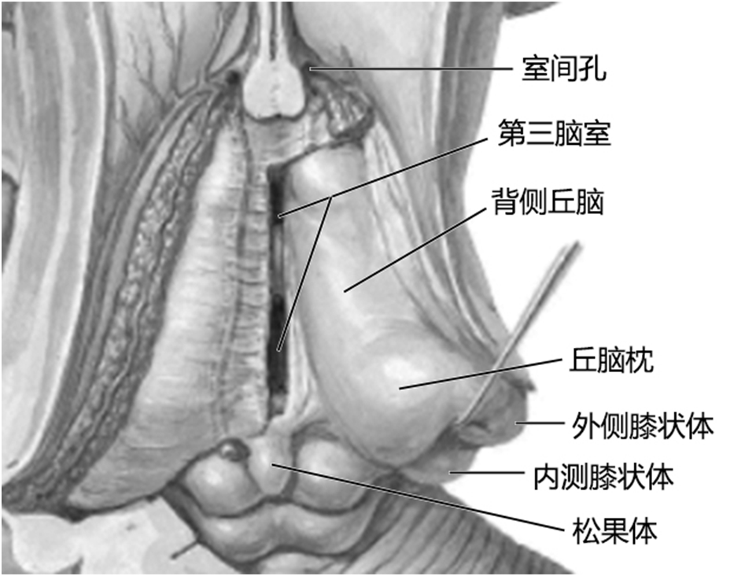

---
tags:
  - anatomy
aliases:
  - 丘脑
---
为两个卵圆形的灰质团块，中间被第三脑室分隔开；
外侧面邻接端脑的尾状核和内囊；前下方邻接下丘脑；后方邻接后丘脑。
[Open: Pasted image 20260916100506.png](attachments/80a3454253c2bd0379b249408a1a037f_MD5.jpg)

背侧丘脑的灰质团块，被Y字形内髓板分隔为三个主要的核群，即前核群、内侧核群和外侧核群。其中属特异性中继核团的包括：
（1）![[腹后内侧核]]
（2）![[腹后外侧核]]
