- 分散系
  > 分散相、分散介质
  - 胶体分散系
    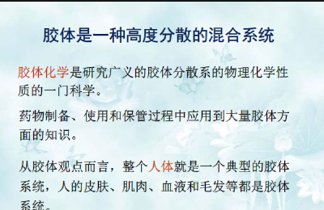
    
    > 溶胶、高分子溶液、缔合胶体
    - 表面和界面
      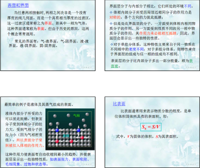
      - ~~表面吸附~~  放出吸附热
        > 吸附等温式 吸附度$\theta$
      - 比表面$\to$ 分散度的表示
        > 高度分散的胶粒比表面大，表面能也大，有自动聚集成大颗粒而减少表面积的趋势，称为结不稳定型，可见溶胶是热力学不稳定系统
- 溶胶
  - 光学性质
    - <u>丁达尔（Tyndall)效应</u>   反射（粗分散体系）散射（胶体）散射光相互干涉而完全抵消（分子溶液）
    - 瑞利公式
      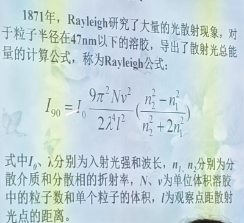
      - $\lambda$ 越小，散射光越强
        > 红灯、朝霞晚霞
      - $n_{1}$ $n_{2}$ 的差值
        > 用于区分溶胶和高分子溶液，高分子溶液分散相和分散介质之间结合力极强，折射率相差不大
      - v越大，散射光越强
        > 鉴别分散体系种类
      - 粒子密度
        > 求相同溶胶的浓度、浊度计
      - 超显微镜原理
        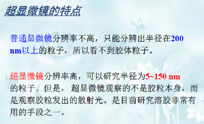
  - 电动现象
    - 因电而动
      - 电泳
        > 蛋白质、氨基酸、核酸等物质的分离和鉴定$\to$ 临床检验
      - 电渗
        > <u>分散介质</u> 的定向移动
    - 因动而电
      > 可能导致严重后果
      - 沉降电势
      - 流动电势
  - 胶团
    > 作为整体运动
    - 结构式$[(AgI)_{m} nI^{-} (n-x)K^{+}]^{x-} xK^{+}$ 由胶粒与扩散层中的反号离子组成
    - 胶粒带电原因
      - 校核界面的选择性吸附
        - 优先吸附与胶核组成相同的离子，利用同离子效应使得胶核不易溶解
        - 若无，则优先吸附水化能力较弱的负离子，所以在自然界中胶粒大多带负电
      - 胶核表面分子的离解
        - 离子溶解
          > 有的离子更易脱离晶格进入溶液
        - 大分子本身发生电离
          > 蛋白质的等电点：pH较高带负电，pH较低带正电
    - 双电层结构(扩散双电层)
      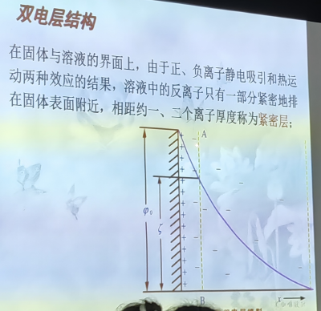
      > $\zeta$ 电势很重要
      - 吸附层
      - 扩散层
    - 溶胶的稳定因素
      - 动力学性质
        - 布朗运动$\to$ 运动中的胶粒不易下沉
          > 花粉小颗粒$\to$ 超显微镜观察到矿物微粒运动  本质是质子的热运动
        - 扩散和沉降平衡
          > 超速离心技术，迅速达到沉降平衡
      - main胶粒带电
        > 胶粒带电，也将阻止胶粒间碰撞聚结。当粒子靠近到一定距离，扩散层重叠，产生静电排斥作用，势能升高。要使粒子聚结必须克服这个势垒。
      - 胶体表面水合膜的保护作用
    - 溶胶的聚沉
      > 聚结不稳定性
      - 电解质的聚沉作用
        > 降低$\zeta$ 电势
        - 临界聚沉浓度
          > 使一定量溶胶在一定时间内完全聚沉所需电解质的最小浓度（mmol/L）
          - 聚沉能力
            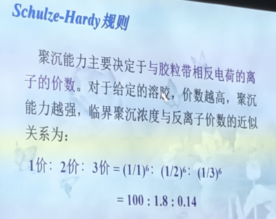
            > 临界聚沉浓度越大的电解质，聚沉能力越小；不会严格地按照上述规则
          - 感胶离子序
            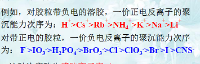
          - 当反号离子相同时，同号离子也会影响
            > 同号离子价数越高或离子越大，聚沉能力越低
          - 有机物离子
            > 表面活性剂、聚酰胺类，可能因为能被校核强烈吸附
      - 溶胶的相互聚沉
        
        > 墨水、豆奶豆浆、精华液乳液
      - 高分子物质对溶胶的保护作用和敏化作用
        > 在生命体中非常重要$\to$ 不能随便用 $K_{sp}$ 计算是否沉淀
      - 气溶胶
        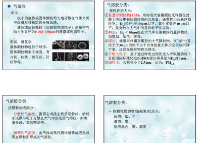
- 高分子溶液
  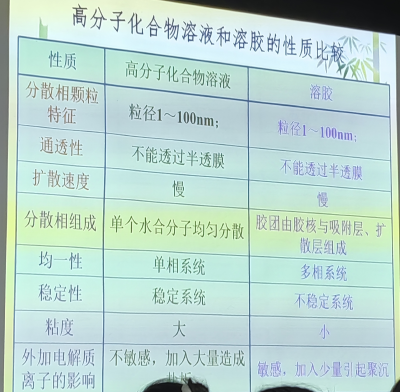
  - 组成和特点
  - 盐析
    - 感胶离子序
      > 建议查阅相应参考文献
- 表面活性剂
  > 缔合胶体
  - 表面张力
    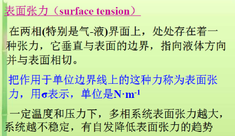
    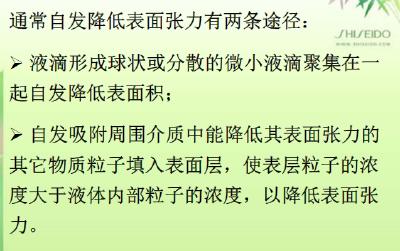
    - 吸附现象
      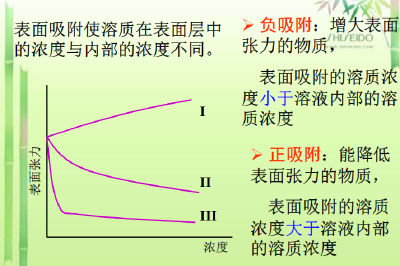
      > 发生在任何两相界面，物质在相界面上浓度自动变化。
      - 表面非活性物质
        > <u>显著</u> 增高表面张力
      - 表面活性物质
        > <u>显著</u> 降低表面张力
      - 非表面活性物质
        > 使表面张力升高或稍微降低
    - 分子结构和原理
      - 亲水基
      - 疏水基/憎水基
    - 缔合胶体
      - 分散相：胶束
- 乳状液
  
  > 粗分散体系
  - 鉴别方法
    - 染色法
    - 稀释法
    - 电导法
  - 医学应用
    - (空)
