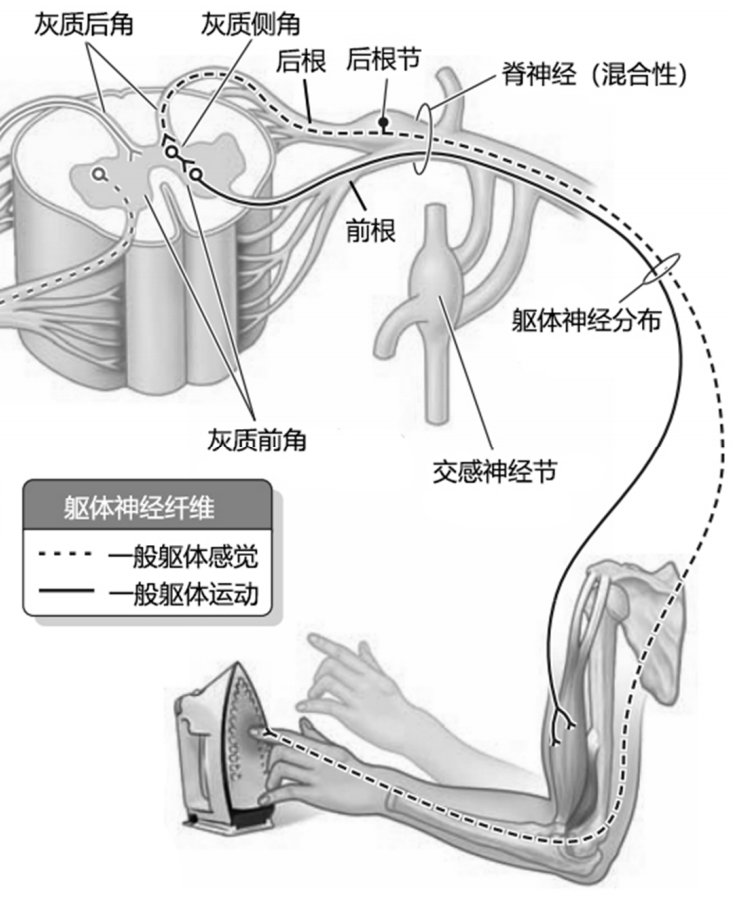
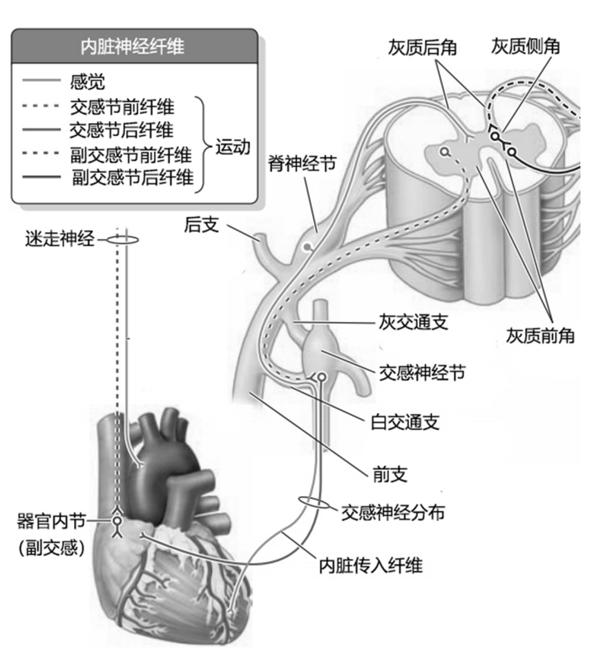

---
tags:
  - Neurology
---
#### 分类
颈神经cervical nerve (C) 8对
胸神经thoracic nerve (T) 12对
腰神经lumbar nerve (L) 5对
骶神经sacral nerve (S) 5对
尾神经coccygeal nerve (Co) 1对

#### 组成
每一对脊神经均包含四种性质的纤维成分：
•躯体感觉纤维分布于皮肤、骨骼肌、肌腱和关节，将支配区的浅、深感觉冲动传入中枢。
•内脏感觉纤维分布于内脏，心血管和腺体，将这些结构的感觉冲动传入中枢。
•躯体运动纤维支配骨骼肌。
•内脏运动纤维属于交感纤维，支配内脏，心血管和腺体。

每对脊神经都以<mark style="background-color: #705A16; color: white">前根和后根</mark>连于一个脊髓节段。
• 前根属运动性，含有躯体运动纤维和内脏运动纤维；
• 后根属感觉性，含有躯体感觉和内脏感觉纤维纤维。后根在椎间孔附近有椭圆形的膨大，称脊神经节，为假单极感觉神经元的胞体的所在地。其周围突加入脊神经，中枢突进入脊髓后角。
• 前、后根在椎间孔处合成一条混合性的脊神经。
[Open: Pasted image 20260904084231.png](attachments/be76d204b13b2eff179d496947e2cc23_MD5.jpg)

脊神经<mark style="background-color: #705A16; color: white">出椎间孔后</mark>，立即分为：
• 前支粗大，除第2 〜12对胸脊神经前支直接分布于躯干以外，其余的脊神经前支都是先相互联合形成神经丛，然后由丛发出神经到其分布区域；
• 后支细小，行向背部，按节段分布于背部的肌和皮肤；
• 脊膜支细小，分布于脊柱；
• 交通支连接交感干。
[Open: Pasted image 20260904084327.png](attachments/214cef53854e6ebc6613a639f626fdbf_MD5.jpg)

