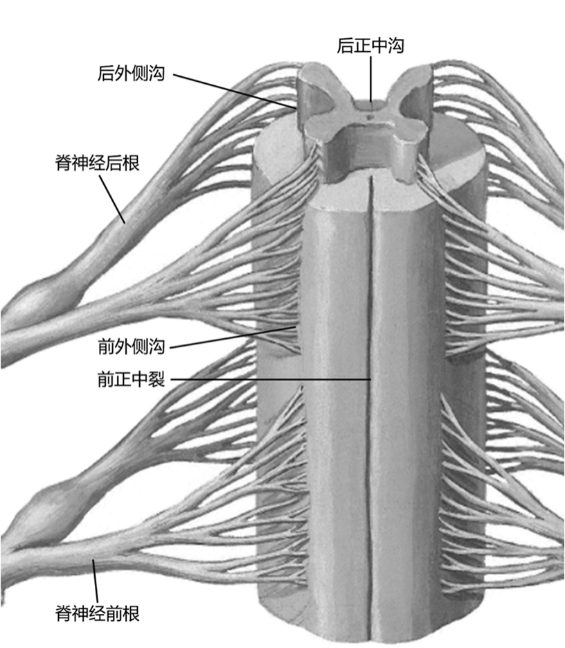
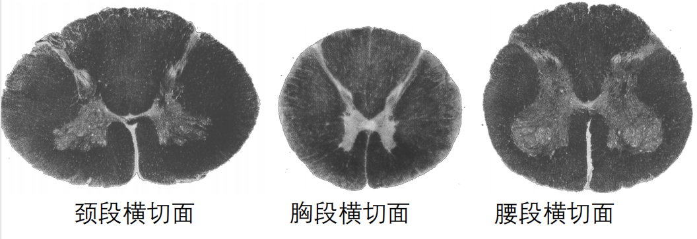

---
tags:
  - Neurology
  - anatomy
---
脊髓起于胚胎时期神经管的后部，分化较少，保持明显的节段性。正常生理条件下，能独立完成一些反射活动，在脑的控制下可执行复杂功能。

#### （一）脊髓的位置和外形
###### 1.位置 
脊髓位于椎管内，外包被膜，上端在枕骨大孔处与延髓相连，下端逐渐变细，以脊髓圆锥终于第1腰椎下缘。新生儿月平第3腰椎。
###### 2.形态 
呈前后稍扁的圆柱形，下端变细形成脊髓圆锥，向下延为细长的、无神经组织的终丝，再向下止于尾骨的背面。

脊髓全长粗细不等，有<mark style="background-color: #705A16; color: white">两个膨大部</mark>：
- 颈膨大自颈髓第 4节到胸髓第1节；
- 腰骶膨大自腰髓第2节至骶髓第3节。
> 膨大部有较多的神经细胞和纤维，与肢体的发达有关。

脊髓表面有6条沟：前面有前正中裂，较深；其外侧有前外侧沟，前根自此沟走出；后面有后正中沟，较浅；其外侧有后外侧沟，后根经此沟进入脊髓。
[Open: Pasted image 20260904092544.png](attachments/a0dbbbf68d194f3dca8cbe4659119ace_MD5.jpg)

#### （二）脊髓的节段
脊髓借每对[脊神经](脊神经.md)根的出入范围划分脊髓节段，共有31节：颈髓8节、胸髓12节、腰髓5节、骶髓5节和尾髓1节。

|脊髓节段|对应椎骨|
|---|---|
|C1~4|C1~C4|
|C5~8|C4~C6|
|T1~4|C7~T3|
|T5~8|T3~T6|
|T9~12|T6~T9|
|L1~5|T10~T12|
|S1~5 & Co|L1|
#### （三）脊髓的内部结构
脊髓各节段内部结构的基本特征是一致的。
中部有细长的中央管；
管的周围是的[灰质](灰质.md)；灰质的外面是[白质](白质.md)，主要是纵行排列的上、下行纤维束。
[Open: Pasted image 20260904093235.png](attachments/5093ea8a6ce01674c324d6ecf725280c_MD5.jpg)

#### （四）脊髓的功能
###### 1．传导功能：
脊髓白质中的上行或下行传导束是传导功能的主要结构，它使身体周围部分与脑的各部联系起来，是脑与周围神经联系的重要通道。
###### 2．反射功能：
脊髓作为一个低级中枢，其灰质内存在许多反射中枢，可执行一些简单的反射活动，如排便反射及躯体的浅、深反射中枢。脊髓的各种反射都通过脊髓节段内和节段间的反射弧完成的。

