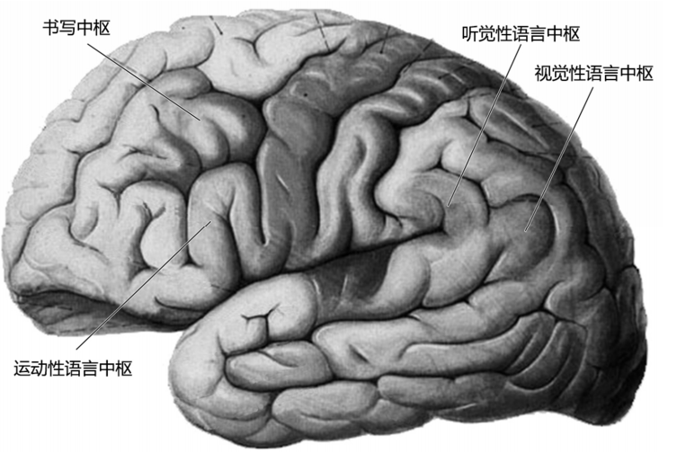
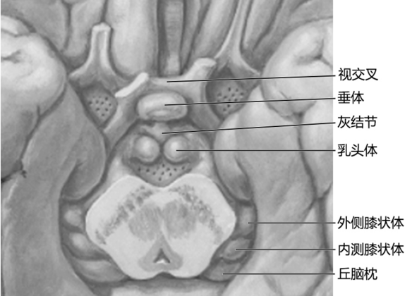

---
tags:
  - TCM
  - pathology
  - Neurology
---
脑位于颅腔内，形态和功能复杂，从头侧向尾侧可分为端脑、间脑、中脑、脑桥、延髓和连于后二者背侧的小脑，延髓下端在枕骨大孔处连接脊髓。
### 端脑
端脑由两侧大脑半球借胼胝体连接而成，是脑的最发达部位。
左右两大脑半球之间由大脑纵裂将其分开。大脑纵裂的底部有连接两半球的横行纤维，称[[胼胝体]]。
半球表面为一层灰质，称大脑皮质。
皮质的深面是髓质（或白质）。髓质中包藏一些核团，位置靠近脑底，故名[[基底核]]。
白质由大量的神经纤维组成，可分为三类纤维：
1）<mark style="background-color: #705A16; color: white">联络纤维</mark>联系同侧大脑半球各部分之间。
2）<mark style="background-color: #705A16; color: white">连合纤维</mark>连接左、右大脑半球，主要结构为胼胝体。
3）<mark style="background-color: #705A16; color: white">投射纤维</mark>联系大脑半球与下位各级脑和脊髓。绝大部分上、下行投射纤维都经过[内囊](内囊.md)。
大脑半球内部的腔隙为[[侧脑室]]。

大脑半球有三个深而恒定的沟作为分叶的标志：
• 外侧沟
• 中央沟
• 顶枕沟
借上述三沟可将半球分为额、顶、颞、枕、岛五叶
#### ![[额叶]]
#### ![[顶叶]]
#### ![[颞叶]]
#### ![[枕叶]]
#### 大脑皮质功能定位
大脑皮质是高级神经活动的物质基础，机体各种机能的最高中枢在大脑皮质上都有相对特定的功能区。介于各功能区之间的联络区，对到达大脑的各种信息进行加工和整合，完成更加复杂的高级神经精神活动。
###### （1）躯体运动中枢：
位于中央前回和中央旁小叶的前部，管理全身骨骼肌的随意运动。
• 身体各部在本区的投影呈倒置人形，<mark style="background-color: #1A4F10; color: white">但头部的投影是正的</mark>。
• 左、右交叉支配，即一侧运动区支配对侧肢体的运动。<mark style="background-color: #3F4B5E; color: white">但一些与联合运动有关的肌肉则受双侧运动区的支配</mark>，如面上部肌、眼球外肌、咽喉肌、咀嚼肌、呼吸肌和躯干肌等，故当一侧运动区受损后这些肌肉不出现瘫痪。
• 身体各部代表区的大小与<mark style="background-color: #1A4F10; color: white">运动的灵巧、精细程度</mark>有关，如拇指的代表区大于躯干或大腿区。
###### （2）躯体感觉中枢：
位于中央后回和中央旁小叶后部，管理全身的浅感觉和深感觉。
其特点于躯体运动中枢相似，体感觉敏感的部位其投射区面积较大，如手指、唇和舌的投射区最大。
###### （3）视觉中枢：
位于距状裂两侧的皮质。一侧视区接受同侧视网膜颞侧半和对侧视网膜鼻侧半的纤维。因此，当一侧视区损伤时，可引起双眼对侧视野同向性偏盲。
###### （4）听觉中枢：
位于颞横回。<mark style="background-color: #1A4F10; color: white">每侧听区接受双侧</mark>的听觉冲动。
因此，一侧听区受损不致引起全聋。
###### （5）语言中枢
语言中枢在发育初期，两侧半球均有发展，但此后却侧重在一侧半球上发展起来，因此，该侧半球称为“优势半球”。一般认为，善用右手者（右利者）其优势半球在左侧，而善用左手者（左利者）其优势半球也在左侧，仅少数人位于右侧。
• 运动性语言中枢（说话中枢）位于额下回后部
• 听觉性语言中枢（听话中枢）位于颞上回后部
• 书写中枢位于额中回的后部
• 视觉性语言中枢（阅读中枢）位于角回
[Open: Pasted image 20260916110929.png](attachments/da580c0c9a6536098d858d030c7cf709_MD5.jpg)

### 间脑
间脑位于中脑和端脑之间。由于端脑高度发达与扩展，几乎将间脑全部掩盖，仅间脑腹侧部的视交叉、漏斗、乳头体等结构外露于脑底。
间脑外侧与端脑融合，边界不清。
[Open: Pasted image 20260916100238.png](attachments/64f81c9a43e8ce7b2a3f269dc784f9a4_MD5.jpg)

间脑的中间有一窄腔，称为[[第三脑室]]
间脑主要包括[[背侧丘脑]]、[[下丘脑]]和[[后丘脑]]等部分。

#### 边缘叶
行为异常
情绪记忆障碍
幻觉

### 小脑
小脑蚓部损害
小脑。。损害
### 脑干

![[脑干]]

---
### ！参见[神经系统疾病](神经系统疾病.md)

[脑血管病](脑血管病.md)
感染性疾病
	脑实质炎症/病变
		[乙脑](乙脑.md)
		[海绵状脑病](海绵状脑病.md)
		[[狂犬病]]
	[脑膜炎](脑膜炎.md)
	[脑脓肿](脑脓肿.md)
[神经系统变性疾病](神经系统变性疾病.md)
[癫痫](癫痫.md)
免疫疾病
	多发性硬化
[[脑肿瘤]]
颅脑外伤
	脑震荡、脑挫裂伤、颅骨骨折
代谢/中毒性脑病
	[肺性脑病](肺性脑病.md)
	[肝性脑病](肝性脑病.md)
	[脑水肿](脑水肿.md)
[脑积水](脑积水.md)

| 疾病分类          | 疾病/亚型                           | 好发部位 / 特征性表现                                                                                                                                                                                                                                                                                                                                                                                                                                                                                                 |
| ------------- | ------------------------------- | ------------------------------------------------------------------------------------------------------------------------------------------------------------------------------------------------------------------------------------------------------------------------------------------------------------------------------------------------------------------------------------------------------------------------------------------------------------------------------------------------------------ |
| **脑血管病**      | [高血压](高血压.md)性脑出血               | 壳核（<mark style="background-color: #1A4F10; color: white">基底节区</mark>，豆纹动脉破裂）→ 丘脑、脑桥、小脑                                                                                                                                                                                                                                                                                                                                                                                                                       |
|               | 血栓性[脑梗死](脑梗死.md)                | <mark style="background-color: #1A4F10; color: white">颈内动脉与大脑前动脉、中动脉分支处</mark>以及后交通动脉及基底动脉                                                                                                                                                                                                                                                                                                                                                                                                                   |
|               | [蛛网膜下腔出血](蛛网膜下腔出血.md)           | 脑底动脉环（<mark style="background-color: #1A4F10; color: white">Willis环）前半</mark>部                                                                                                                                                                                                                                                                                                                                                                                                                               |
| **感染**        | 结核性脑膜炎                          | 以脑底最明显，可累及颌下淋巴结                                                                                                                                                                                                                                                                                                                                                                                                                                         |
|               | [流脑](流脑.md)                     | 定位于软脑膜，蛛网膜下腔脑脊液循环                                                                                                                                                                                                                                                                                                                                                                                                                                       |
|               | 病毒性脑炎（单纯疱疹病毒[[HSV]]）            | 颞叶、额叶眶面（MRI可见出血坏死） #AI                                                                                                                                                                                                                                                                                                                                                                                                                                     |
|               | [乙脑](乙脑.md)                     | <mark style="background-color: #1A4F10; color: white">大脑皮质、基底节、视丘</mark>最重；小脑皮质 丘脑 脑桥次之                                                                                                                                                                                                                                                                                                                                                                                                                      |
|               | [海绵状脑病](海绵状脑病.md)（克雅氏病）         | <mark style="background-color: #1A4F10; color: white">大脑皮质</mark>和深部灰质(<mark style="background-color: #1A4F10; color: white">尾状核和壳核</mark>)                                                                                                                                                                                                                                                                                                                                                                  |
|               | [脑脓肿](脑脓肿.md)                   | 血源性（败血症）：灰白质交界处（大脑中动脉供血区最多见，因该区血流量大，栓子易停留） #AI 。 耳源性：<mark style="background-color: #1A4F10; color: white">颞叶</mark>或<mark style="background-color: #1A4F10; color: white">小脑</mark> 鼻源性（鼻窦炎，尤其额窦炎）：<mark style="background-color: #1A4F10; color: white">额叶</mark> 胸源性（慢性脓胸、支气管扩张等）：<mark style="background-color: #1A4F10; color: white">额叶、顶叶</mark>（多见于大脑中动脉供应区，机制同血源性，因病原菌经肺静脉→体循环播散 #AI ） |
| **神经退行性疾病**   | [Alzheimer病](Alzheimer病.md)     | 尤以额叶、<mark style="background-color: #1A4F10; color: white">颞叶</mark>和顶叶最为显著                                                                                                                                                                                                                                                                                                                                                                                                                                  |
|               | [Parkinson 病](Parkinson%20病.md) | 中脑<mark style="background-color: #1A4F10; color: white">黑质</mark>致密部                                                                                                                                                                                                                                                                                                                                                                                                                                         |
|               | 亨廷顿舞蹈病                          | 尾状核、壳核（纹状体显著萎缩） #AI                                                                                                                                                                                                                                                                                                                                                                                                                                        |
|               | 运动神经元病（ALS）                     | 脊髓前角细胞、皮质脊髓束（临床常考颈膨大、脑干运动核） #AI                                                                                                                                                                                                                                                                                                                                                                                                                            |
| **癫痫**        | [癫痫](癫痫.md)                     | 海马硬化（颞叶内侧） #AI                                                                                                                                                                                                                                                                                                                                                                                                                                             |
| **免疫**        | 多发性硬化（MS）                       | 侧脑室周围白质、胼胝体、视神经、颈髓（Dawson手指征） #AI                                                                                                                                                                                                                                                                                                                                                                                                                          |
| [脑肿瘤](脑肿瘤.md) | 转移瘤                             | 灰白质交界处                                                                                                                                                                                                                                                                                                                                                                                                                                                                                                       |
|               | 胶质母细胞瘤                          | 大脑半球白质（<mark style="background-color: #1A4F10; color: white">额叶、颞叶</mark>多见）                                                                                                                                                                                                                                                                                                                                                                                                                                 |
|               | 少突胶质细胞肿瘤                        | 好发于大脑半球皮质和白质 <mark style="background-color: #1A4F10; color: white">额叶</mark>多见                                                                                                                                                                                                                                                                                                                                                                                                                               |
|               | 脑膜瘤                             | <mark style="background-color: #1A4F10; color: white">上矢状窦两侧</mark>大脑镰两旁                                                                                                                                                                                                                                                                                                                                                                                                                                     |
|               | 髓母细胞瘤                           | <mark style="background-color: #1A4F10; color: white">小脑蚓部</mark>（第四脑室顶，儿童多见） 起源于<mark style="background-color: #705A16; color: white">小脑</mark>胚胎性外颗粒层细胞或<mark style="background-color: #705A16; color: white">室管膜</mark>下基质细胞                                                                                                                                                                                                                      |
| **颅脑外伤**      | 脑震荡                             | 通常无肉眼病灶（弥漫性轴索损伤：胼胝体、脑干上端） #AI                                                                                                                                                                                                                                                                                                                                                                                                                              |
|               | 脑挫裂伤                            | 对冲伤：额叶底部、颞叶前极（枕部受撞击时） #AI                                                                                                                                                                                                                                                                                                                                                                                                                                  |
|               | 颅骨骨折                            | 颅中窝（岩骨）→脑脊液耳漏； 颅前窝（筛板）→脑脊液鼻漏                                                                                                                                                                                                                                                                                                                                                                                                                                                                              |
|               | 硬膜外血肿                           | 颞部（翼点），脑膜中动脉破裂 #AI                                                                                                                                                                                                                                                                                                                                                                                                                                         |
|               | 硬膜下血肿                           | 额顶叶大脑凸面，桥静脉破裂 #AI                                                                                                                                                                                                                                                                                                                                                                                                                                          |

---
TCM
主宰生命活动
主精神活动
主感觉和运动