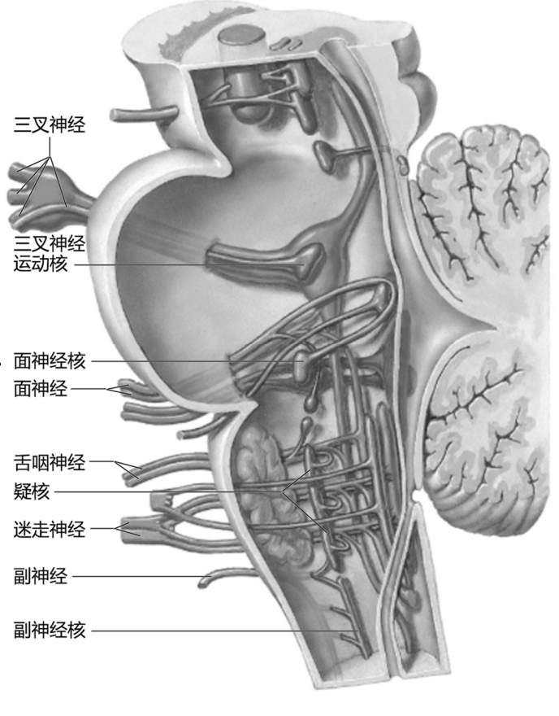
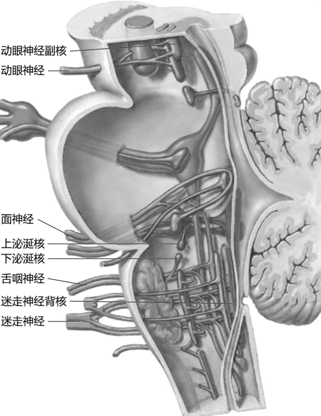
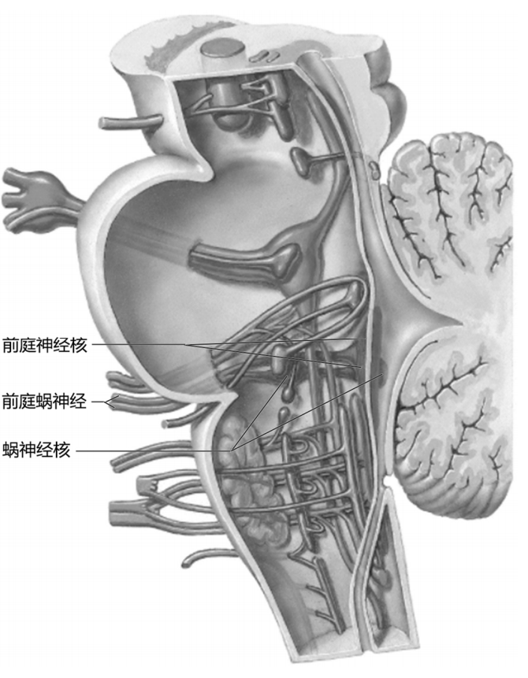
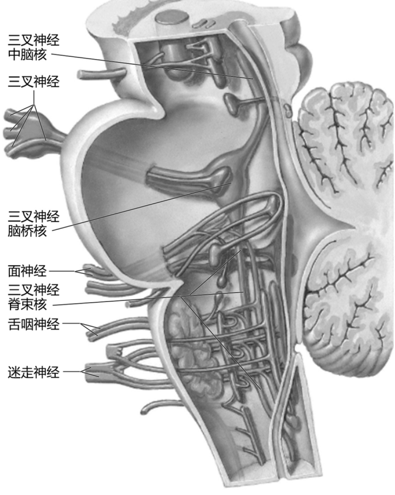

---
tags:
  - Neurology
---
脑干由延髓、脑桥和中脑三部分组成。延髓和脑桥的背面与小脑相连，它们之间的腔为[[第四脑室]]，将小脑摘去，可见由延髓背面上部和脑桥背面构成的第四脑室底，称菱形窝。

### 脑干的内部结构 
由灰质、白质和网状结构组成，
其特点是：
①灰质不再连贯成柱，而成为分离断续的核团。
②纤维束在脑干内交叉传导，打乱了脊髓原来的灰、白质的界限。
③在延髓上部和脑桥，原脊髓中央管周围的灰质成为第四脑室的室底灰质。
④脑干中央的网状结构范围比脊髓扩大
#### 灰质
##### 1.脑神经核
第Ⅲ ～ Ⅻ对脑神经的核团都位于脑干内。它们在脑干内的排列原则与脊髓基本相似。由于中央管后壁开放向两侧展开，原先腹背方向排列的脊髓灰质变成内外方向排列的室底灰质。
不同性质的脑神经核在脑干内排列成6个纵行的细胞柱。每一个柱代表一个单独的功能体系，称之为功能柱。
<mark style="background-color: #705A16; color: white">a. 躯体运动柱</mark>
a)动眼神经核：中脑上丘平面
b)滑车神经核：中脑下丘平面。
c)展神经核：面丘。
d)舌下神经核：舌下神经三角
<mark style="background-color: #705A16; color: white">b. 特殊内脏运动柱</mark>
a)三叉神经运动核：脑桥中部
b)面神经核：脑桥下部
c)疑核：延髓上部——舌咽神经、迷走神经、副神经脑根
d)副神经核：C1～ 5前角的背外侧部——副神经脊髓根
[Open: Pasted image 20260908183049.png](attachments/17de474dc1752aae2d28bc259917503a_MD5.jpg)

<mark style="background-color: #705A16; color: white">c. 内脏运动柱</mark>
a)动眼神经副核：中脑
b)上泌涎核：脑桥下部——面神经
c)下泌涎核：延髓上部——舌咽神经
d)迷走神经背核：延髓
[Open: Pasted image 20260908183018.png](attachments/1613fcdd3aa1472e923dc86b842eb3b4_MD5.jpg)

<mark style="background-color: #705A16; color: white">d. 内脏感觉柱</mark>：
孤束核（面神经、舌咽神经和迷走神经）
<mark style="background-color: #705A16; color: white">e. 特殊躯体感觉柱</mark>
a)蜗神经核：脑桥——听觉纤维
b)前庭神经核：脑桥——平衡觉纤维。
[Open: Pasted image 20260908182951.png](attachments/e26058b8ccb4523bec6aa17684f45aef_MD5.jpg)

<mark style="background-color: #705A16; color: white">f. 一般躯体感觉柱</mark>
a)三叉神经中脑核：是唯一位于中枢内的第一级感觉神经元，传导本体感觉。
b)三叉神经脑桥核：与头面部的触、压觉传递有关。
c)三叉神经脊束核：接受头面部以及眼、鼻、口粘膜的痛、温觉。
[Open: Pasted image 20260908182651.png](attachments/b77172232c3c4e486be75953f332dfb0_MD5.jpg)

##### 2.非脑神经核
###### 薄束核与楔束核
分别位于延髓的薄束结节和楔束结节深面，它们接受薄束和楔束的纤维。发出的纤维经内侧丘系交叉在对侧上行为内侧丘系。薄束核和楔束核是向脑传递躯干和四肢本体感觉和精细触觉的中继核团。
###### 红核
位于中脑，呈圆柱状。红核是与躯体运动有关的核团。主要接受来自小脑和大脑皮质的纤维。此核发出的纤维交叉至对侧组成红核脊髓束在脊髓下行，主要终止于颈髓节段中间带和前角的外侧部，借此影响脊髓前角运动神经元的活动。
###### 黑质
位于中脑，主要由含黑色素的神经元组成，故呈黑色。黑质主要由多巴胺能神经元组成，合成的多巴胺递质释放到大脑的新纹状体内。当黑质细胞病变时，黑质和新纹状体内多巴胺水平降低，患者表现为肌肉强直、运动受限或减少并出现震颤，称帕金森病。因此，一般认为黑质是参与基底核调节随意运动的重要结构。

#### 白质
###### 1）内侧丘系：
薄束核和楔束核发出的上行纤维，呈弓状绕过延髓中央管，并在其腹侧左、右交叉，称丘系交叉，交叉后的纤维组成内侧丘系，在中线两侧、锥体的后方上行，终止于背侧丘脑的腹后外侧核。交叉后内侧丘系纤维传导对侧躯干和四肢的本体感觉和皮肤的精细触觉冲动。

---
### 中脑

![[中脑]]

---
### 脑桥

![[脑桥]]

Millard-Gubler syndrome
患侧眼球不能外展，周围性面瘫，对侧中枢性偏瘫，对侧偏身感觉障碍
闭锁综合征
双侧脑桥基底部损害，双侧中枢性瘫痪，感觉和意识正常，只能以眨眼或眼球垂直性运动

---
### 延髓

![[延髓]]

![[延髓背外侧综合征]]

