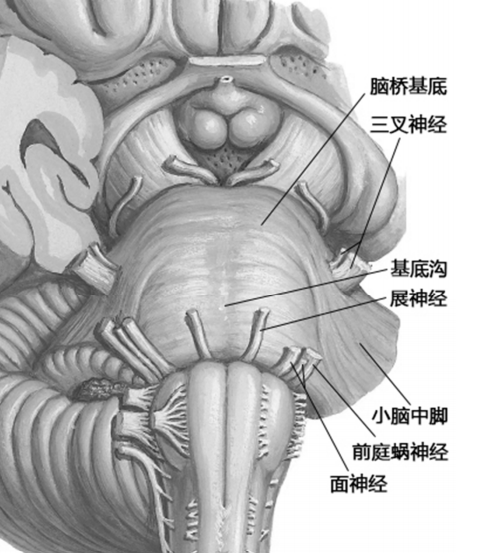

---
tags:
  - Neurology
---
#### 解剖
###### 正面
- 脑桥基底部
- 基底沟
- 小脑中脚
- 三叉神经、展神经、面神经和前庭蜗神经
[Open: Pasted image 20260908162712.png](attachments/2d98880aac6497180c1c38c54f6ec6a5_MD5.jpg)

###### 背面
- 第四脑室底的上半部
- 小脑中脚
- 小脑上脚
- 上髓帆
[174Open: Pasted image 20260908162603.png](attachments/f5d3847eb022824c372410124d396067_MD5.jpg)
