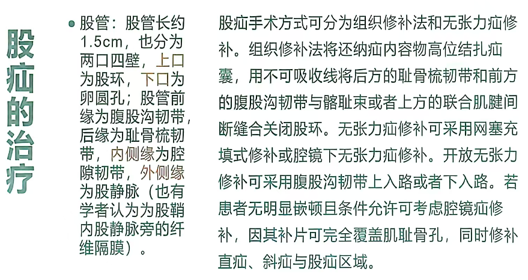
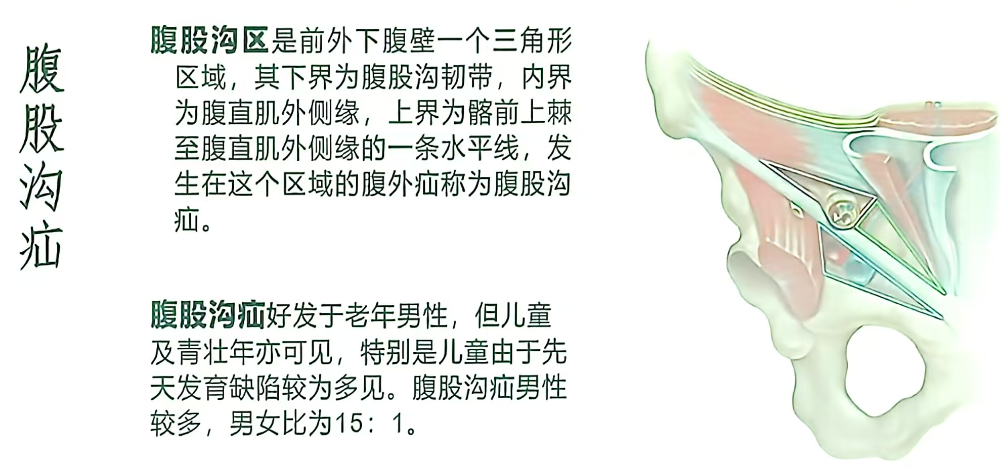
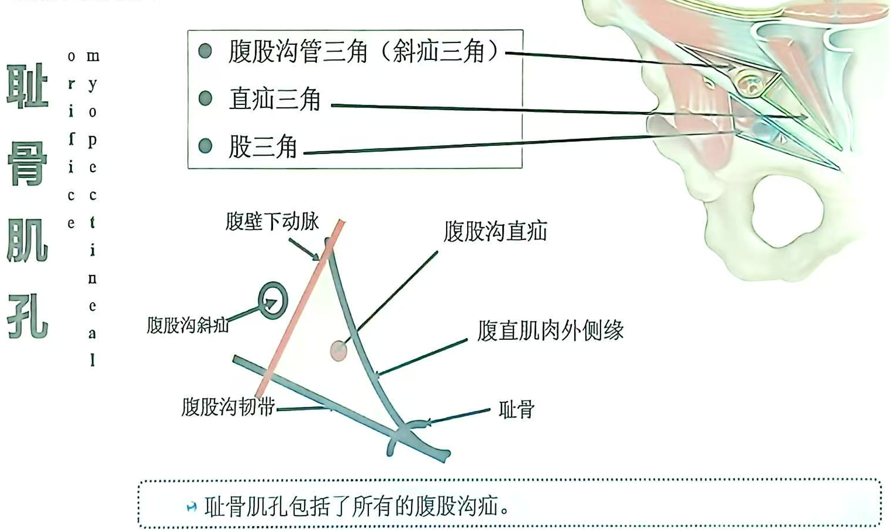

---
tags:
  - digestive
---
[Open: Pasted image 20260929094104.png](attachments/beb523624663320af67a085d68a8a940_MD5.jpg)

#### 腹股沟疝
最常见的为腹股沟疝，约占90%。
##### 病因
先天因素：遗传因素，常常传男；解剖上
后天因素
#### 临床表现
[Open: Pasted image 20260929093153.png](attachments/1d9210f9e7feb0439431b43908d77701_MD5.jpg)

<mark style="background-color: #1A4F10; color: white">可复性包块</mark>为腹股沟疝特征性临床表现
[Open: Pasted image 20260929093334.png](attachments/8d9cb1a9f21e1ded474613f8b587e9fe_MD5.jpg)

