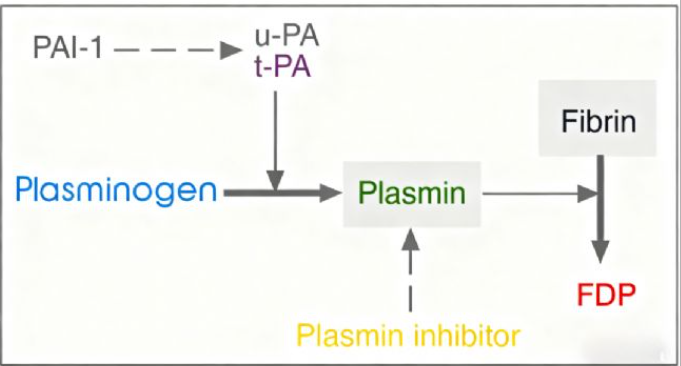
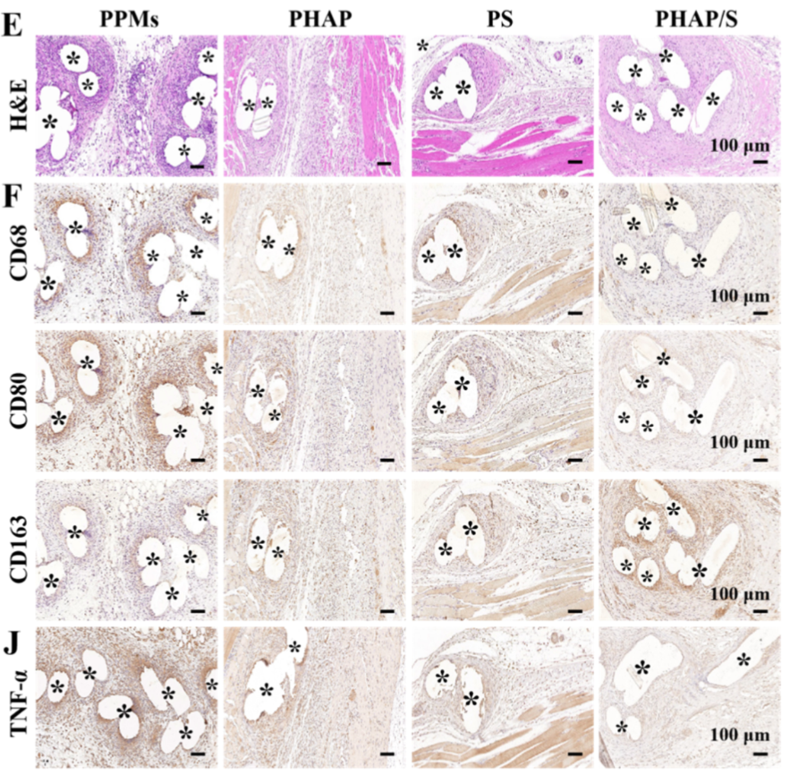
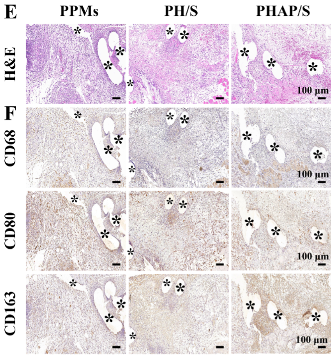

---
tags:
  - Proj
---
[腹腔防粘连材料后续安排](腹腔防粘连材料后续安排.md)

[[EGCG]]
#### 粘连相关解释
##### 物理阻隔
感觉是材料方面最喜欢的说法
> [!PDF|rouge] [Janus网片, p.219](Janus网片.pdf#page=2&selection=68,57,69,36&color=rouge)
> > directly isolate adjacent normal organs from the mesh

#### 抗炎相关指标
###### ROS
> [!PDF|yellow] [Janus网片, p.219](Janus网片.pdf#page=2&selection=1,55,4,47&color=yellow)
> >  In addition, the PPMs are still recognized as the foreign body, after all, leading to an <mark style="background-color: #1A4F10; color: white">inflammatory reaction and subsequent permanent adhesions</mark> formed between the mesh and abdominal viscera [12,13].

> [!PDF|purple] [Janus网片, p.220](Janus网片.pdf#page=3&selection=30,0,61,31&color=purple)
> > the lack of anti-oxidative and anti-inflammatory ability can also hinder the hernia repair due to the oxidative stress caused by<mark style="background-color: #705A16; color: white"> reactive oxygen species (ROS)</mark>, which can exacerbate peritoneal adhesion, inhibit normal tissue repair and regeneration, further promote inflammation, necrosis, fibrosis, and finally worsen the complication

[Epigallocatechin-3-gallate (EGCG) based metal-polyphenol nanoformulations alleviates chondrocytes inflammation by modulating synovial macrophages polarization - ScienceDirect](https://www.sciencedirect.com/science/article/pii/S0753332223001543#2)

[Open: Pasted image 20260901161451.png](attachments/756014032e096c94963f7ed542a4355c_MD5.jpg)

[Open: Pasted image 20260901161823.png](attachments/4fa26ec0788569b69d24820f59e10ff1_MD5.jpg)

> [!PDF|yellow] [ROS染色质疑, p.2](ROS染色质疑.pdf#page=2&selection=51,0,55,8&color=yellow)
> > DCFH2-DA is a widely used probe for detecting intracellular oxidative stress due to its cell permeability and fluorescent readout.

###### TNF-α
> [!PDF|yellow] [synergistic induction of reactive oxygen species storms and EGCG release, p.16](synergistic%20induction%20of%20reactive%20oxygen%20species%20storms%20and%20EGCG%20release.pdf#page=16&selection=0,17,10,17&color=yellow)
> > Au@Ti3C2-E@H attenuates oxidative stress at the wound by upregulating Sirt1 and downregulating NF-κB, which in turn inhibits the expression of TNF-α, IL-6 and MMP-9.
> 
> “-E”就是负载

##### IL-6
<mark style="background-color: #1A4F10; color: white">骨骼肌</mark>是公认的IL-6来源之一——肌纤维在损伤、牵拉、再生过程中会表达和分泌IL-6，它属于“肌因子”家族。
> [!PDF|yellow] [EGCG_reverses_muscle-derived_IL-6, p.2](EGCG_reverses_muscle-derived_IL-6.pdf#page=2&selection=129,0,132,1&color=yellow)
> > suppression of IL-6 synthesis from myocytes 
> 
> 肌细胞也会产生IL-6

> [!PDF|yellow] [EGCG_reverses_muscle-derived_IL-6, p.11](EGCG_reverses_muscle-derived_IL-6.pdf#page=11&selection=0,0,10,23&color=yellow)
> > Macrophages dominate a basic inflammatory response in muscle that follows a particular stimulus or injury [31]. Moreover, in inflamed tissue, macrophages is the main source of IL-6 [32]
> 
> 不过<mark style="background-color: #1A4F10; color: white">巨噬细胞还是主要</mark>的产生途径

#idea 如果 EGCG 保护了肌纤维，存活下来的肌肉组织可能更多，从而改变了局部微环境？
- 实验组 EGCG 抗氧化，可能保护肌组织，促进肌再生，导致更多肌纤维分泌IL-6。肌纤维分泌IL-6可能参与肌卫星细胞增殖、成纤维细胞迁移，促进有序修复。
- 而粘连组肠管覆盖，抑制肌组织长入，肌组织少，IL-6低。
这可以解释“未粘连组/实验组IL-6高”。
**验证：**
- 如果阳性信号呈长条状、沿肌纤维胞浆分布，细胞核位于周边，那很可能是肌纤维来源。
- 如果阳性信号是圆形、散在的单个核细胞，则更可能是巨噬细胞或其他免疫细胞。
把IL-6阳性面积归一化到肌纤维面积？

> [!PDF|yellow] [EGCG_oxidative and imflammation, p.10](EGCG_oxidative%20and%20imflammation.pdf#page=10&selection=178,15,182,64&color=yellow)
> > after being treated with EGCG HYPOT2, hNPCs show significantly down-regulated expression of MMP-3, MMP-13, IL-6 and TNF-α, due to the anti-inflammatory and antioxidative effects of EGCG
> 
> IL-6本来应该下调啊TT

#### 粘连相关指标
###### 联系炎症指标
> [!PDF|rouge] [Advanced postoperative tissue antiadhesive membranes enabled with electrospun nanofibers, p.1645](Advanced%20postoperative%20tissue%20antiadhesive%20membranes%20enabled%20with%20electrospun%20nanofibers.pdf#page=3&selection=189,41,212,30&color=rouge)
> > TNF-α induces the production of IL-6, exacerbating inflammation and ECM synthesis. IL-1 and TNF-α further induce IL-6, contributing to adhesion formation. The overexpression of TGF-β triggers fibrosis and tissue adhesion. 

> [!PDF|yellow] [Advanced postoperative tissue antiadhesive membranes enabled with electrospun nanofibers, p.1653](Advanced%20postoperative%20tissue%20antiadhesive%20membranes%20enabled%20with%20electrospun%20nanofibers.pdf#page=11&selection=188,11,191,22&color=yellow)
> > Additionally, collagen synthesis, accumulation of inflammatory cytokines, and proliferation of fibroblasts accelerate the formation of adhesions in the epidural operative area after surgical trauma.

###### t-PA/PAI-1 共染
  [plasminogen activator inhibitor](https://www.sciencedirect.com/topics/pharmacology-toxicology-and-pharmaceutical-science/plasminogen-activator-inhibitor) (PAI-1) and [Tissue plasminogen activator](https://www.sciencedirect.com/topics/pharmacology-toxicology-and-pharmaceutical-science/tissue-plasminogen-activator) (t-PA)
  [Open: Pasted image 20260826160416.png](diary/NOTES/attachments/759242818847f49ca0493635a95a75e7_MD5.jpg)
[Open: Pasted image 20260911084047.png](attachments/2e25186e4a07f2cc9c1af74ab71c23ec_MD5.jpg)

> [!PDF|yellow] [Janus网片, p.231](Janus网片.pdf#page=14&selection=36,12,42,62&color=yellow)
> > TNF-α is a pivotal predisposing factor in <mark style="background-color: #1A4F10; color: white">adhesion formation</mark>, which not only <mark style="background-color: #1A4F10; color: white">promotes inflammation</mark> but also induces the imbalance of fibrinolysis by <mark style="background-color: #1A4F10; color: white">stimulating the release of plasminogen activator inhibitors and inhibiting the production of plasminogen activato</mark>

[Bioinspired Janus Mesh with Mechanical Support and Side-specific Biofunctions for Hernia Repair - ScienceDirect](https://www.sciencedirect.com/science/article/pii/S1742706124007293#sec0029)

[Microwave-responsive ionic liquid with enhanced bactericidal, biocompatible and immunoregulatory properties for the prevention of abdominal adhesion - ScienceDirect](https://www.sciencedirect.com/science/article/pii/S138589472505257X#s0055)
[Open: Pasted image 20260826172641.png](diary/NOTES/attachments/364a0978c9f7ec9135769db0fc4a004f_MD5.jpg)

[Engineering ROS-responsive double network hydrogel as bioactive barrier for postoperative abdominal adhesions prevention - ScienceDirect](https://www.sciencedirect.com/science/article/pii/S2452199X25003147)
[Bottlebrush inspired injectable hydrogel for rapid prevention of postoperative and recurrent adhesion - ScienceDirect](https://www.sciencedirect.com/science/article/pii/S2452199X22000822)

原理性文章：
[Postoperative abdominal adhesions: pathogenesis and advances in hydrogel-based multimodal prevention strategies - ScienceDirect](https://www.sciencedirect.com/science/article/pii/S1742706125005768)
[Open: Pasted image 20260826173219.png](diary/NOTES/attachments/6504c3c7497059b55f25ef83d47a78b0_MD5.jpg)

[An injectable and antifouling self-fused supramolecular hydrogel for preventing postoperative and recurrent adhesions - ScienceDirect](https://www.sciencedirect.com/science/article/pii/S1385894720332241)
>The analysis of t-PA and PAI-1 was also performed _via_ immunofluorescence staining. Briefly, the tissue sections paraffin-embedded (5 μm) were deparaffinized, rehydrated and washed with 1% PBS. They were blocked with goat serum and incubated with the following antibodies: anti-t-PA (1:100, Cat. No. NBP2-67279; Novus Biologicals, United States), and anti-PAI-1 (1:100, Cat. No. NBP1-19773; Novus Biologicals, United States). Then goat anti-mouse IgG, Alexa Fluor® 594-conjugated (1:100, Cat. No. 8890S; CST, United States) was incubated with anti-t-PA, and goat anti-rabbit IgG, Alexa Fluor® 488-conjugated, (1:100, Cat. No. 4412S; CST, United States) was incubated with anti-PAI-1, respectively. Finally, the slides were then counter-stained with [DAPI](https://www.sciencedirect.com/topics/pharmacology-toxicology-and-pharmaceutical-science/4-6-diamidino-2-phenylindole) for 10 min. Images were acquired by a fluorescence microscope (NIKON ECLIPSE TI-SR, Japan).
[Open: Pasted image 20260826173603.png](diary/NOTES/attachments/b5f417d635a035f73cf087d70df47c70_MD5.jpg)

[An anti-inflammatory chondroitin sulfate-poly(lactic-co-glycolic acid) composite electrospinning membrane for postoperative abdominal adhesion prevention† | Biomaterials Science | The Royal Society of Chemistry](https://pubs.rsc.org/bm/article/11/19/6573/796414/An-anti-inflammatory-chondroitin-sulfate-poly)
[Open: Pasted image 20260826175038.png](diary/NOTES/attachments/2d399e8c7f0b8d49220e2341ad324b97_MD5.jpg)

>Double immunostaining of PAI-1 and t-PA was performed to investigate the expressions of PAI-1 and t-PA from adhesion-related tissues. Samples were incubated in primary antibodies overnight at 4 °C, including mouse antirat PAI-1 antibody (1 : 100, cat. no.: 66261-1-Ig, Proteintech Group, USA) and rabbit antirat t-PA antibody (1 : 50, cat. no.: 10147-1-AP, Proteintech Group, USA), and then treated with Alexa Fluor 594-conjugated goat antimouse IgG (1 : 1000, cat. no. 8890S; Cell Signaling Technology, USA) and Alexa Fluor 488-conjugated goat antirabbit Immunoglobulin G (IgG) (1 : 1000, cat. no. 4412S; Cell Signaling Technology, USA). The stained samples were further incubated with DAPI for 30 min and observed using a microscope (BX53, Olympus).

###### α-SMA
> [!PDF|yellow] [EGCG_Nrf2, p.11](EGCG_Nrf2.pdf#page=11&selection=326,0,329,28&color=yellow)
> > α-SMA myofibroblasts, a distinct subset of dermal fibroblasts, are crucial for the synthesis of type I collagen 

#### 各文献创新方向
##### 双面
> [!PDF|yellow] [Janus网片, p.219](Janus网片.pdf#page=2&selection=77,25,82,60&color=yellow)
> > Recently, inspired by the peritoneum whose one side facing the abdominal viscera holds significant antifouling performance while the other side can integrate with the soft tissue firmly, the construction of asymmetric Janus hydrogels has gained considerable attentions in the internal soft-tissue defect repair due to their appropriate integration of adhesion and anti-adhesion performance

> [!PDF|yellow] [Janus网片, p.220](Janus网片.pdf#page=3&selection=3,65,19,49&color=yellow)
> > the light-initiated graft polymerization (LIGP) offers the prospect of imparting desirable properties to polymer product

---
#### 实验结果 
##### collagen
有胶原沉积增加的都是促愈合相关的文章

> [!PDF|yellow] [Janus网片, p.230](Janus网片.pdf#page=13&selection=0,11,0,60&color=yellow)
> > the PHAP side connecting compactly with the wound

> [!PDF|blueee] [Janus网片, p.232](Janus网片.pdf#page=15&selection=55,0,58,25&color=blueee)
> > The results showed that the Janus PHAP/S mesh group had the <mark style="background-color: #1A4F10; color: white">most obvious</mark> collagen deposition phenomenon, and the collagen was arranged in an orderly manner, demonstrating its superior pro-healing property than other group

> [!PDF|blueee] [EGCG_Nrf2, p.11](EGCG_Nrf2.pdf#page=11&selection=258,14,276,1&color=blueee)
> > the levels of collagen types I and III in the HP and EGCG groups were<mark style="background-color: #1A4F10; color: white"> lower than those in the HPE group but higher than those in the control group</mark> (Fig. 5D-E). This trend was consistent with the results observed in Masson's staining. TEM imaging

> [!PDF|blueee] [EGCG_Nrf2, p.11](EGCG_Nrf2.pdf#page=11&selection=282,18,283,20&color=blueee)
> > collagen fibers in the HPE group were more orderly and densely arranged
> 
> 明确说了<mark style="background-color: #1A4F10; color: white">实验组</mark>（E代表EGCG）的胶原沉积<mark style="background-color: #1A4F10; color: white">更</mark>有序和<mark style="background-color: #1A4F10; color: white">密集</mark>

> [!PDF|green] [EGCG_Nrf2, p.17](EGCG_Nrf2.pdf#page=17&selection=0,48,8,53&color=green)
> > the hydrogel induces macrophage polarization toward the M2 phenotype, which reduces the secretion of inflammatory cytokines (IL-1β and TNF-α) and increases the release of anti-inflammatory factors (IL-4 and IL-10)
> 
> 但仍然抗炎

> [!PDF|blueee] [EGCG_Nrf2, p.15](EGCG_Nrf2.pdf#page=15&selection=213,10,220,31&color=blueee)
> >  including IL-1β, TNF-α, IL-4, TGF-β, CD68, iNOS, and CD206 were assessed at the wound site

> [!PDF|yellow] [EGCG_Nrf2, p.11](EGCG_Nrf2.pdf#page=11&selection=428,13,433,17&color=yellow)
> > sustained EGCG release from the HPE hydrogel significantly enhanced wound angiogenesis. To further assess pro-angiogenic activity, IHC/IF staining was conducted for vascular endothelial growth factor A (VEGFA),
> 
> 这篇文章还管了促愈合

> [!PDF|yellow] [Advanced postoperative tissue antiadhesive membranes enabled with electrospun nanofibers, p.1650](Advanced%20postoperative%20tissue%20antiadhesive%20membranes%20enabled%20with%20electrospun%20nanofibers.pdf#page=8&selection=3,28,6,36&color=yellow)
> > Moreover, the porous structure of the nanofibers allows signaling molecules and nutrients to be exchanged through the membrane, <mark style="background-color: #1A4F10; color: white">increasing collagen levels and stimulating tendon regeneration</mark>.

> [!PDF|green] [An anti-inflammatory chondroitin sulfate-poly, p.6578](An%20anti-inflammatory%20chondroitin%20sulfate-poly.pdf#page=6&selection=63,59,66,38&color=green)
> > In contrast, there were less adhesion in the PLGA/CS9010 and PLGA/CS8020 groups, and only a minimal amount of collagen tissues was observed (Fig. 5b and c). 
> 
> 另一篇文章，实验组胶原沉积是更少的

##### imflammatory

[Open: Pasted image 20260911080731.png](attachments/b3e4d65ee8792e19fc102a69cacc03f6_MD5.jpg)

> [!PDF|yellow] [Janus网片, p.230](Janus网片.pdf#page=13&selection=1,35,2,66&color=yellow)
> > PS modified one-sided meshes and PHAP modified one-sided meshes were administered as control groups

> [!PDF|yellow] [Janus网片, p.229](Janus网片.pdf#page=12&selection=77,36,77,68&color=yellow)
> > the PS side facing the abdominal

> [!PDF|rouge] [Janus网片, p.231](Janus网片.pdf#page=14&selection=48,63,67,20&color=rouge)
> > he lowest expression of TNF-α was recorded in the double-sided PHAP/S mesh group, which led to a significant reduction compared with other groups, thereby achieving an alleviated inflammatory infiltration around the implant. 

[Open: Pasted image 20260911080854.png](attachments/32063b9afa29db3e5ef771dff167880a_MD5.jpg)

> [!PDF|yellow] [Janus网片, p.231](Janus网片.pdf#page=14&selection=0,24,4,29&color=yellow)
> > inflammatory cells around the PHAP/S-treated wound tissue was significantly reduced on the 14th day compared with that in other three groups, which was well consistent with the observation that the Janus PHAP/S mesh treated group demonstrated no detectable adhesion formation

> [!PDF|green] [Janus网片, p.231](Janus网片.pdf#page=14&selection=30,21,34,10&color=green)
> >  Janus PHAP/S mesh was the most effective treatment in inhibiting implant related inflammatory response, and this phenomenon was consistent with that in H&E staining

---
#### 关注的因素
##### 机械应力
> [!PDF|green] [Janus网片, p.219](Janus网片.pdf#page=2&selection=86,51,87,43&color=green)
> > ntra-abdominal pressure and the uneven transmission loads 
> 
> 不能再赞同

