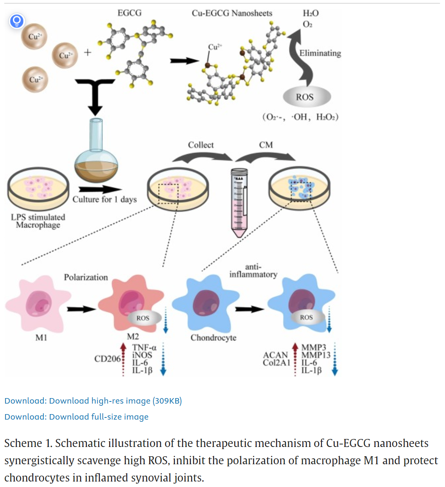
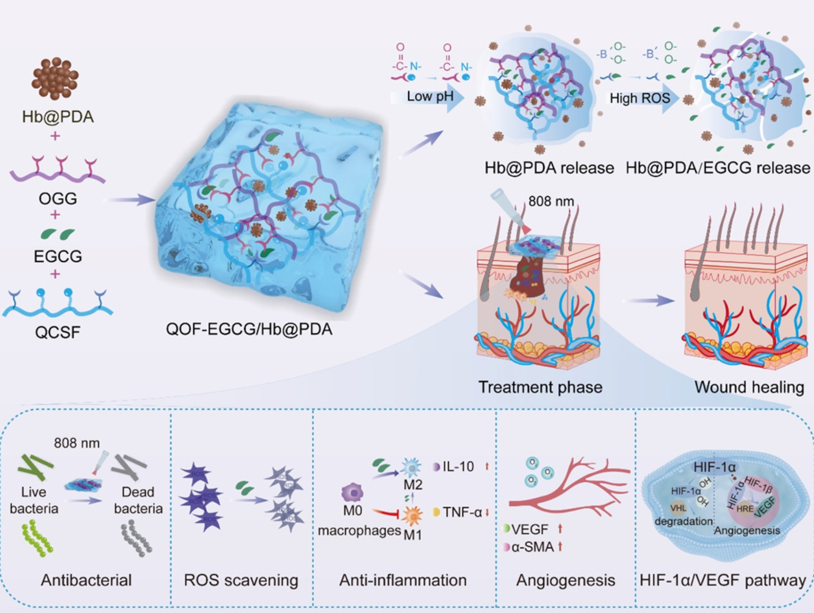

---
tags:
  - Proj
---
[腹腔防粘连材料后续安排](腹腔防粘连材料后续安排.md)
#### 抗炎相关指标
[Epigallocatechin-3-gallate (EGCG) based metal-polyphenol nanoformulations alleviates chondrocytes inflammation by modulating synovial macrophages polarization - ScienceDirect](https://www.sciencedirect.com/science/article/pii/S0753332223001543#2)

[Open: Pasted image 20260901161451.png](attachments/756014032e096c94963f7ed542a4355c_MD5.jpg)

[Open: Pasted image 20260901161823.png](attachments/4fa26ec0788569b69d24820f59e10ff1_MD5.jpg)

