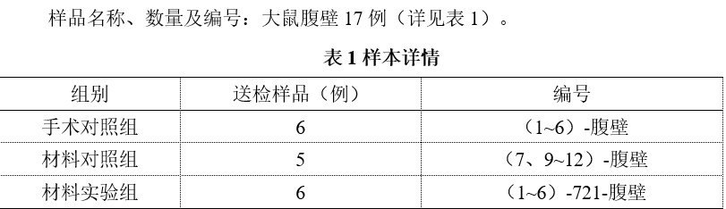

目前只送染了HE，还有
E. Masson染色；
F. t-PA/PAI-1 共染；
G. IL-6 免疫组化；
H. CD68/CD206 免疫荧光；
I. ……（maybe抗氧化指标）；
其中Masson染色和t-PA/PAI-1 共染是必要的

[20260724A47998--四川大学华西医院 陈小薇 大鼠 腹壁组织病理检测报告](20260724A47998--四川大学华西医院%20陈小薇%20大鼠%20腹壁组织病理检测报告.doc)

[Open: Pasted image 20260817130229.png](attachments/b1880c7fc8fcf2daf465832be1edd3a2_MD5.jpg)
