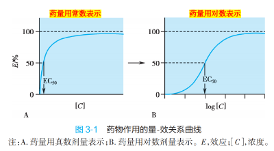
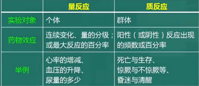
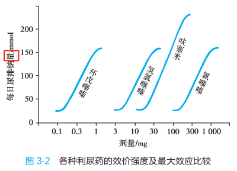
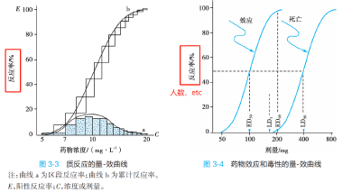
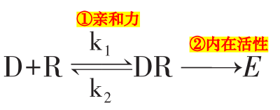
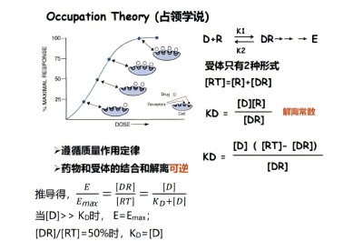
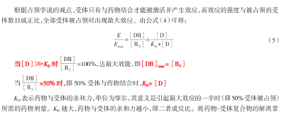

---
aliases:
  - Pharmacodynamics
---

- 药效学 研究药物对机体的作用，包括药物的药理作用、作用机制、临床应用、不良反应
> 区分：action 药理作用-药物与细胞起始的相互作用；effect-药理效应-作用结果。
> 通过药物作用，可以推导药理效应。

##### （一）药物的基本作用
######  <u>1. 药物作用（Drug Action）</u> 
药物对机体的初始作用。体现为药物小分子与机体细胞大分子之间的初始反应。
- *局部作用 & 全身作用*
> *吸收入血前*  *在*  *局部给药部位*  *发生 vs*  *吸收入血后*  *分布于全身发生*
- *直接作用 & 间接作用*
> 药物直接作用于分布的组织器官 vs 药物的直接作用引起的其他效果
-  药物 <mark style="background-color:#fef3c7;"> 作用 </mark> 的 <mark style="background-color:#fef3c7;"> 特异性 </mark> （specificity） ：与 化学反应的专一性、药物的化学结构 有关。
>注意区分“特异性”和“选择性”的概念。eg Atropine  特异性阻断 M-胆碱受体
######  <u>2. 药理效应（Pharmacological Effect）</u> 
药物作用的结果；机体反应的表现。
- *兴奋效果（excitation） & 抑制效果（inhibition）*
> 使机体原有功能水平提高 vs 降低；前者被称为兴奋剂（stimulant），后者被称为抑制剂（depressant）
-  药理 <mark style="background-color:#fef3c7;"> 效应 </mark> 的 <mark style="background-color:#fef3c7;"> 选择性 </mark> （selectivity） ：在一定的剂量下，药物对不同组织器官作用的差异性； 不同剂量  用药也会体现出不同的药效选择性，例如各组织器官分布相应受体不同
- 原因：药物在体内分布不均匀：药物对不同组织器官的亲和性不同；
- [[表观分布容积]]  [Vd](表观分布容积.md)
######  <u>3. 治疗效果（Therapeutic Effect）</u> 
  - 定义：指药物作用的结果有利于改变患者的生理、生化功能或病理过程而使得患者的机体恢复正常的作用。
> “治疗“：相对于“病理”的一个“恢复”概念
  （1）对因治疗（  etiological  treatment）：消除原发致病因子，彻底治愈疾病（抗生素杀灭致病菌）。
  （2）对症治疗（symptomatic treatment）：改善症状 不能根除病因
  （3）补充治疗（supplement therapy/  replacement therapy  ）： 通过给予外源性物质来纠正体内营养或代谢物质的缺乏，标本兼治
###### 4.  ADR 
![[不良反应]]

##### （二）药物的量效关系（Dose-Effect Relationship）
- 药物的剂量（浓度）与效应的关系被称为药物的量效关系。在一定范围内，药效随药物的剂量（浓度）增加（减少）而增强（减弱）。
###### 1. 量效曲线（浓度-效应曲线）
  - 纵坐标—— 药效强度；横坐标——药物剂量（血药浓度）。
	
	
  I. 量反应（Quantitative Dose Response/Graded Response）
	
(1)定义：药效的强弱 随药量呈 连续性 的增减变化。可用具体数量或最大反应的百分率表示，eg 心率、血压。
“等级反应”
(2)量反应的[[量-效曲线]]（形状&参数）
II. 质反应（Quantal Response/All-or-None Response）
	
（1）定义： “全或无反应”→ 药效不随药量的增减呈连续性的量的变化，而表现为 反应性质 的变化。eg 是否麻醉
（2）质反应的[量-效曲线](量-效曲线.md)
###### 2. 药物安全性评价指标
- ①半数中毒量（Median Toxic Dose, TD50） ： 能引起 50%的实验动物中毒的药物剂量
-  <u>② 治疗指数（Therapeutic Index, TI）：</u> 在 动物试验 中，<mark style="background-color:#fef3c7;"> TI = LD50 / ED50（致死比有效） </mark> ;在 临床上， <mark style="background-color:#fef3c7;"> TI=TD50/ ED50（中毒比有效） </mark>。TD50越大，ED50越小，治疗指数越高，表明安全性越高。
>不完全可靠：有效剂量与其致死剂量之间有重叠。
>药物的治疗窗： 通常位于中间的部位，即药物需要拥 有较大的疗效与较弱的不良反应
- ③ 安全窗（安全系数，Margin of Safety） ： <mark style="background-color:#fef3c7;"> LD5—ED95 </mark>。引起 5%的实验动物死亡的效应量与引起 95%的实验动物出现阳性反应的效应量之差
-  <u>④ 可靠安全系数（Reliable Safety Coefficient）：</u> 引起  1%的 实验动物死亡的效应量 （LD1） 与引起  99%的 实验动物出现阳性反应 （ED99 ） 的效应量之<mark style="background-color:#fef3c7;">比 </mark><mark style="background-color:#fef3c7;"> LD1/ED99 </mark>  >1，表明药物绝对安全。 
###### 3. 药物的构效关系（Structure Activity Relationship） 
药物的化学结构与药理活性或毒性之间的关系

##### （三）药物作用的机制
###### 1. 基本作用机制：非特异性 & 特异性
  - （1）非特异性药物作用: 主要与药物的理化性质有关，通过 改变细胞周围的理化条件 而发挥作用。
	- 改变 渗透压 ( 甘露醇 脱水， 硫酸镁 导泻)
	- 改变 pH ( 抗酸药 治疗溃疡病)
	- 络合 作用( 二巯基丁二酸钠 等络合剂解救重金属中毒)。
  - （2）特异性 药物作用: 结构特异性药物 与机体生物大分子(如酶和受体)功能基团结合而发挥作用，大多数药物属于此类。
	- 特异性药物的选择性与效应的发挥依赖于 药物与受体之间的接触。
	  - ①药物受体： 作为内源性调节配体的受体的蛋白质。许多药物依赖生理性受体发挥作用，并常常具有选择性。
	  - ②配体： 与受体特异性结合的生物活性物质
	  - ③受点（位点）：能与配体结合的活性基团。
> 非竞争性阻断剂位点与药物不同。
- [[第二信使]]相关知识
###### 2. 受体的特性= 灵敏性+特异性+饱和性+可逆性+多样性
  - ①灵敏性（sensitivity） ：很低浓度的配体-受体结合就能产生显著的效应；
	- 配体 结合能力越强，药理活性越强。 
  - ②特异性（specificity） ：特定受体与特定配体结合产生特定效应。
	- 引起某一类型受体兴奋反应的配体的 <u>化学结构非常相似（结构转一性）</u>
	- 不同光学异构体的反应可以完全不同 <u>（立体选择性）</u>
	- 同一类型的激动药与同一类型的受体结合时 <u>产生的效应类似</u>
  - ③饱和性（saturability） ：受体数目一定。配体与受体结合的剂量 -反应曲线具有饱和性、 <u>受体饱和时达到药物最大效应</u> ；作用于同一受体的配体之间存在竞争现象。
  - ④可逆性（reversibility） ：配体与受体结合可以解离， <u>解离后可得到原来的配体而非代谢物</u> ；
  - ⑤多样性（diversity） ：同一受体可广泛分布到不同的细胞而产生不同效应（具有亚型分类；受体受生理、病理及药理因素调节，经常处于动态变化之中。
  - ⑥受体具有 内源性配体。
######  3. 受体类型
  - （1）按受体所在位置不同
	- ①细胞膜受体:胆碱受体、肾上腺素受体、多巴胺受体
	- ② 胞浆受体:肾上腺皮质激素、性激素 
	- ③ 胞核受体:甲状腺激素 
  - （2）按受体蛋白结构和信号转导的机制不同
	- ①含离子通道的受体：GABA受体
	- ②G蛋白偶联受体：M-受体、肾上腺素受体、多巴胺受体
	- ③酪氨酸激酶受体：[胰岛素](胰岛素.md)、生长因子、[[神经营养因子]]
	- ④调节基因表达的受体：[[甾体激素]]、[[甲状腺激素]]
###### 4. 受体的调节
  - 定义：受体 <u>数目</u> 和 <u>亲和力</u> 的变化。脱敏 & 增敏
  - （1）脱敏（Receptor Desensitization）——向下调节
	- 见于： 长期使用  激动剂 ，使受体数目减少
	- 表现： 耐受性
> 对激动药的敏感性和反应性下降，如异丙肾上腺素治疗哮喘，疗效下降

  - （2）增敏（Receptor Hypersensitization）——向上调节
	- 见于： 长期使用  拮抗剂 ，使受体数目增加
	- 表现： 反跳现象
	- 例如：普萘洛尔突然停药，敏感性增高
######  <u>5. 药物与受体的相互作用</u> 
  
  -  <u>（1）亲和力(affinity)</u> ：药物与受体的结合能力。
  -  <u>（2）内在活性(intrinsic activity)：</u> 药物激动受体引起最大生物效应的能力
	- 激动剂  α=1 ；部分激动剂  0＜α<1 （有部分内在活性）； 拮抗剂  α=0 （占着xx不xx）
  - （3）药物与受体结合的效应/药物分类（围绕“亲和力”与“内在活性”展开）
	- ① [[激动药]]（[agonist](激动药.md)）
	- ② [[拮抗药]]（[antagonist](拮抗药.md)）
  - （4）构效关系 & 量效关系
	- 构效关系:药物 结构 与药理活性之间的关系;
	- 量效关系: 药物 剂量 与药理活性之间的关系
  - （5）基本公式及参数：KD、α、  <u>pD2和 pA2</u> 
	
	
	- ① KD：  解离常数 ——引起 最大效应的一半时（50%的受体被占领） 的药物 剂量 。 单位：mol。  KD与药物的亲和力成反比。
	  - 取药物 KD的负对数-lgKD，则产生pD2（亲和力指数），其值与亲和力成正比
	- ② α ： 内在活性 ——决定药物与受体结合后产生效应大小的性质。
	  - 当两种药物亲和力相等时，效应强度取决于内在活性的强弱；当内在活性相等时，效应强度取决于药物亲和力的大小。
	-  <u>③ pD2和 pA2的意义</u> 
	  - pD2： 亲和力指数。药物的解离常数 KD的负对数(-lgKD) 。是受体激动药 半最大效应浓度 的 负对数值 ， 与亲和力成正比。 
	  - pA2： 拮抗参数。表示受体拮抗药 对激动药的 拮抗作用强度。当激动药与拮抗药合用时， 使两倍于原浓度的激动药/仅仅引起原浓度激动药效应时/所使用的拮抗药摩尔浓度/的负对数值。   pA2=-log[I]=-logKI。 表示  竞争性  拮抗药的作用强度，  与药物拮抗作用成正比。 
> 姐们你这个定义再绕一点呢？笑晕
-  拮抗参数也可以判断激动药的性质。 若两种激动药 可以被同一拮抗药拮抗并且拮抗参数相近 ，说明这两种激动药 作用于同一种受体。

###### 6. 药物与受体作用机制学说
  - （1）占领学说 ： ① 受体只有与药物 结合才能被激活 并产生效应；②效应的 强度与 被占领的受体 数目成正比 ；③当受体 全部被占据时 ，药物能发挥出 最大效应。
	- 不足： 不能解释某些药物在引起最大效应时靶器官尚有 95﹪-99﹪的受体未被占领。
	- 修正：药物与受体亲和并且发挥作用的能力依赖于 ： 亲和力/受体结合难易程度(affinity）+内在活性/引起药理效应的活力(intrinsic activity) 
	  - 备用受体学说
		- 药物引起最大效应时 ,不一定占领全部受体
		- 药物既具有 亲和力 又具有 内在活性， 才能引起生物效应
		- 药物引起最大效应时未被占领的受体叫储备受体
  - （2）速率学说：药物发挥作用最重要的因素是药物分子与受体结合—分离的速率，即药物分子与受体碰撞的频率
	- 要点
	  - 药理效应的大小不与占领受体数量成正比，而与药物单位时间内与受体的结合速率常数(k1)和解离速率常数(k2)有关。
	  - 激动剂的 k2 值大，解离快；部分激动剂和拮抗剂的 k2 值小，解离慢。
	- 不足： 不能解释药物与受体多种类型的相互作用。
  - （3）二态模型学说（变构学说）
	- 受体有两种状态，即失活态(Ri)和活化态 (Ra)，二者可互变。
	- 激动剂主要与 Ra结合，拮抗剂主要与 Ri结合，部分激动剂与 Ra及 Ri均有一定的结合。与 Ra结合可产生效应，与 R i结合不产生效应。