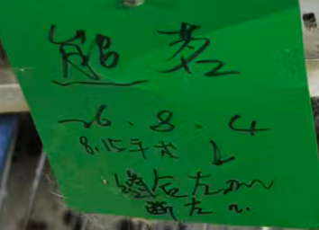

###### 动物——
1.**分组**：Sham组（暴露不损伤）+ 材料对照组 + 材料实验组（各组 n=？）；可考虑增设模型对照组 (Model)，仅损伤，不植入任何材料
- 取材分配（每只动物均取两种组织）：
	**神经** → 戊二醛/ PFA → 用于 TEM、轴突计数、NF 免疫组化。
	**肌肉**（甲杓肌） → 液氮速冻一部分，固定一部分（OCT/ PFA） → 用于 qPCR（BDNF/炎症因子）、肌纤维形态（H&E）、NMJ荧光染色（需OCT固定）/免疫组化（PFA固定）。
2.**品种**：
New Zealand rabbits
- <mark style="background-color: #1A4F10; color: white">male</mark> New Zealand white rabbits (3 months old, ≈3 ± 0.2 kg) [Characteristics of Nerve Injury, Regeneration, and Vocal Fold Movement After Recurrent Laryngeal Nerve Electrocautery Injury](Characteristics%20of%20Nerve%20Injury,%20Regeneration,%20and%20Vocal%20Fold%20Movement%20After%20Recurrent%20Laryngeal%20Nerve%20Electrocautery%20Injury.pdf)
  <mark style="background-color: #1A4F10; color: white">male</mark> New Zealand white rabbits (3 months old, ≈3 ± 0.2 kg) 
  [Ultrastructural and Automated Vocal Fold Tracking Study in Recurrent Laryngeal Nerve Injury Models](Ultrastructural%20and%20Automated%20Vocal%20Fold%20Tracking%20Study%20in%20Recurrent%20Laryngeal%20Nerve%20Injury%20Models.pdf) 
  ↑2篇文章是同一个杂志，同一群作者，同一个实验
  
- 2.0–3.0 kg的<mark style="background-color: #1A4F10; color: white">雌性</mark>新西兰白兔 [PCL Nerve Guide Conduit Coated_translated.pdf](PCL%20Nerve%20Guide%20Conduit%20Coated_translated.pdf.pdf)
-  <mark style="background-color: #1A4F10; color: white">female</mark> New Zealand white rabbits about 2 kg at 12 weeks of age [Platelet-rich plasma loaded nerve guidance conduit as implantable biocompatible materials for recurrent laryngeal nerve regeneration - PMC](https://pmc.ncbi.nlm.nih.gov/articles/PMC9474804/#Sec7)
- [Ultrastructural and Automated Vocal Fold Tracking Study in Recurrent Laryngeal Nerve Injury Models](Ultrastructural%20and%20Automated%20Vocal%20Fold%20Tracking%20Study%20in%20Recurrent%20Laryngeal%20Nerve%20Injury%20Models.pdf)

###### 试剂——
麻醉
- 戊巴比妥钠：<mark style="background-color: #1A4F10; color: white">3%</mark> pentobarbital sodium solution injected through the <mark style="background-color: #1A4F10; color: white">ear vein</mark> with a dose of <mark style="background-color: #1A4F10; color: white">30 mg/kg</mark>
- 速眠新配合戊巴比妥钠：combination of intramuscular injection of **Su-Mian-Xin (0.1 ml/kg)** 肌内注射 and slow intravenous injection of 3% **pentobarbital (0.3–0.5 ml/kg)** via the marginal ear vein.耳缘静脉注射 [Characteristics of Nerve Injury, Regeneration, and Vocal Fold Movement After Recurrent Laryngeal Nerve Electrocautery Injury](Characteristics%20of%20Nerve%20Injury,%20Regeneration,%20and%20Vocal%20Fold%20Movement%20After%20Recurrent%20Laryngeal%20Nerve%20Electrocautery%20Injury.pdf)；  [Ultrastructural and Automated Vocal Fold Tracking Study in Recurrent Laryngeal Nerve Injury Models](Ultrastructural%20and%20Automated%20Vocal%20Fold%20Tracking%20Study%20in%20Recurrent%20Laryngeal%20Nerve%20Injury%20Models.pdf)
- ~~15 mg/kg的唑拉西泮和5 mg/kg的赛拉嗪~~：1）左侧股部注射 [PCL Nerve Guide Conduit Coated_translated.pdf](PCL%20Nerve%20Guide%20Conduit%20Coated_translated.pdf.pdf)；2）Preoperatively, animals were anesthetized with 5 mg/kg subcutaneous xylazine赛拉嗪, and immediately prior to surgery, an intramuscular injection of 15 mg/kg zolazepam唑拉西泮 was administered [Platelet-rich plasma loaded nerve guidance conduit as implantable biocompatible materials for recurrent laryngeal nerve regeneration - PMC](https://pmc.ncbi.nlm.nih.gov/articles/PMC9474804/#Sec7)
  
  
  参考[实验动物麻醉药物使用指南 - 浙江大学实验动物中心](https://www.lac.zju.edu.cn/my/control/13140.html) 应当和替来他明一起，起镇痛作用的主要是替来他明（NMDA 受体抑制剂）
###### 耗材与器械——
剃毛器，碘伏棉球，一次性手术巾
5 ml注射器、suture——参考PRP文章，7-0 Vicryl; Ethicon, Somerville, NJ, USA用于神经（如果神经处要缝合），4-0 Vicryl suture用于肌肉、3-0 Nylon= Ethilon (Ethicon, Somerville, NJ)用于皮肤
用于分离的镊子（还是用显微镊？），用于挫伤的蚊氏钳；喉镜

###### 手术——
术前禁食（fasted） 8 小时，但允许自由饮水
备皮，消毒
- 有文章做了术前喉镜to confirm normal bilateral VF movement[Characteristics of Nerve Injury, Regeneration, and Vocal Fold Movement After Recurrent Laryngeal Nerve Electrocautery Injury](Characteristics%20of%20Nerve%20Injury,%20Regeneration,%20and%20Vocal%20Fold%20Movement%20After%20Recurrent%20Laryngeal%20Nerve%20Electrocautery%20Injury.pdf)
- 预防性抗生素使用： #AI 兔手术建议在术前30分钟给予抗生素（如头孢唑林 20mg/kg，肌注），以预防术后感染。
**nerve crush挫伤**
1.切开皮肤，确认颈阔肌和带状肌 (舌骨下肌群)的位置 
2.暴露并分离左OR右侧RLN [局部应用地塞米松在喉返神经损伤后的作用探讨](局部应用地塞米松在喉返神经损伤后的作用探讨.pdf)

3.第**4**气管环水平<mark style="background-color: #1A4F10; color: white">止血钳一扣1分钟</mark>：the right RLN was clamped with a hemostatic forceps for one ratchet click, maintained for 1 min, and then released. [Ultrastructural and Automated Vocal Fold Tracking Study in Recurrent Laryngeal Nerve Injury Models](Ultrastructural%20and%20Automated%20Vocal%20Fold%20Tracking%20Study%20in%20Recurrent%20Laryngeal%20Nerve%20Injury%20Models.pdf)（At the level of the fourth tracheal ring, the nerve was easily identified and dissected over a length of 1–1.5 cm.）
4.喉镜下确认声带运动受损、造模成功
5.缝合OR直接卷套材料
6.缝合切口，消毒

#AI 术后应给予镇痛，如丁丙诺啡（0.01-0.05 mg/kg，皮下注射，q8-12h）

---
**nerve transection横断**
1.切开皮肤，确认颈阔肌和带状肌 (舌骨下肌群)的位置 [PCL Nerve Guide Conduit Coated_translated.pdf](PCL%20Nerve%20Guide%20Conduit%20Coated_translated.pdf.pdf)
2.暴露左侧**喉返神经**，清理神经周围组织。
3.特定位置横断
- At the right side of 3 cm from the cricothyroid joint, the RLN was cut off and the epineurium was anastomosed by end-to-end. （[Insights into the Therapeutic Potential of Heparinized Collagen Scaffolds Loading Human Umbilical Cord Mesenchymal Stem Cells and Nerve Growth Factor for the Repair of Recurrent Laryngeal Nerve Injury - PMC](https://pmc.ncbi.nlm.nih.gov/articles/PMC6171598/)）
- 于2-4气管环水平切除喉返神经1cm [自体成肌细胞对创伤性声门关闭不全恢复影响的实验研究 - 中国优秀硕士学位论文全文数据库](https://cnkimirror.clcn.net.cn/KCMS/detail/detail.aspx?filename=1011162675.nh&dbcode=CMFD&dbname=CMFD2011)
- [PCL Nerve Guide Conduit Coated_translated.pdf](PCL%20Nerve%20Guide%20Conduit%20Coated_translated.pdf.pdf)
  
- The right RLNs of rabbits were preserved as normal controls, but the left RLNs were resected and interposed with an NGC [Platelet-rich plasma loaded nerve guidance conduit as implantable biocompatible materials for recurrent laryngeal nerve regeneration - PMC](https://pmc.ncbi.nlm.nih.gov/articles/PMC9474804/#Sec7)
  
---
**热损伤**
- 第四气管环水平：At the level of the fourth tracheal ring, the nerve was easily identified and dissected over a length of 1–1.5 cm. The right RLN was directly cauterized using monopolar coagulation at 1 W power for 1 second, repeated 3 times 

---
#### 结果

| 笼                                               | 存活/只 |
| ----------------------------------------------- | ---- |
| [Open: Pasted image 20260903093744.png](attachments/c756048117093a355eeb615290bf1a18_MD5.jpg)
  | 2    |
|                                                 |      |

