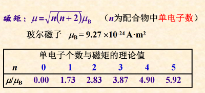
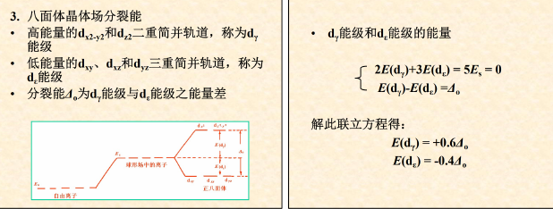
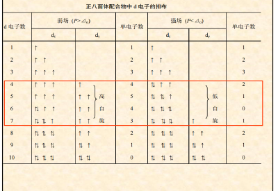
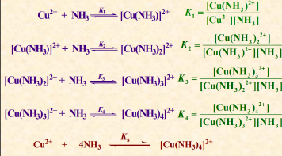
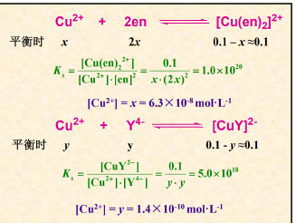
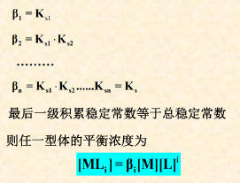
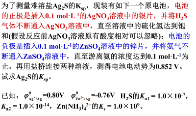

- 基本概念
  - 络合物=配合物
    - 配位键
    - 配离子
  - 组成
    - 内层
      > 配离子，配合物的特征部分
      - 中心原子（配位原子）
      - 配（位）体
        - 单齿配体
          > 如吡啶$（py），CN^-$
        - 多齿配体$\to$ 形成螯合物
          > 乙二胺$en$ 、草酸根 （配位原子O）配位数2
          > 二亚乙基三胺（$DEN$）
          >  乙二胺四乙酸及其二钠盐（$EDTA$）
          > （1：1配合，极好的配位试剂，酸根用$Y^{4-}$表示）配位数是6
    - 外层
  - 命名
    - 阴离子前，阳离子后
    - 配体数——配体名称——“合”——中心原子名称（氧化值）
      > 氧化值用加括号的罗马数字
    - 配体命名顺序
      - 无机配体在前，有机配体在后
      - 先阴离子，后中性分子
      - 同类配体，按 <u>配位原子元素符号的英文字母</u> 顺序先后
        > 若仍相同，则含原子数目少的在前；若依然相同，则按非配位原子的元素符号英文字母顺序
- 配位化合物的化学键理论
  - 价键理论$Pauling L$
    > 在很多情况下，价键理论不能预测配合物的空间构型和杂化类型，一般在取得了配合物的空间构型及磁矩的实验数据后，再用价键理论进行解释。 价键理论能解释配合物的配位数和空间构型，定性的说明内轨型比外轨型稳定。但是不能说明配合物的吸收光谱和颜色，也不能从定量的角度说明配合物的稳定性。晶体场理论能很好解决上述问题
    - 配位键
      - 特殊处：中心原子空轨道经杂化形成杂化轨道后与配体形成配位键
      - 空间构型：取决于中心原子所提供杂化轨道的数目和类型（$sp,sp^3,dsp^2,sp^3d^2,d^2sp^3$）
    - 内轨配合物和外轨配合物
      - 外轨配合物
        > 全部由最外层空轨道杂化
      - 内轨配合物
        > 有次外层d轨道参与杂化（书写时在前边表示来自次外层）
    - 应用
      - 电子重排
        - 一般来说，内层电子重排后会空出部分次外层d轨道，同时单电子数会减少
          > 内轨型为了有空轨道参与杂化，电子必须重排
    - 配合物的磁矩$\mu$
      - 通过测定磁矩，可计算出未成对电子数n ，进而判断中心原子价电子层空轨道的杂化类型及配合物类型
        
      - 单电子数越多，顺磁性越强，磁矩越大
  - 晶体场理论
    - 八面体配位场中心原子d能级分裂
      
    - 分裂能及其影响因素
      - 配体场强
        - 场强越大，分裂能越大
        - 光谱化学序列
      - 中心原子氧化值
    - 八面体配位场中心原子d电子排布
      - $d1~d3$组态， $d8~d10$组态，无论是强场还是弱场配体，电子只有一种排布方式
      - $d4~d7$组态，取决于分裂能Δo和电子成对能P的相对大小。强场配体Δo>P，电子尽可能排布在dε能级的各轨道上；弱场配体Δo<p，电子尽可能分占
        
    - 晶体场稳定化能（不要求计算）
      > 由于中心原子的d轨道能级分裂，电子优先进入能量较低的轨道，与在球形场中相比，系统所降低总能量，称为晶体场稳定化能。
    - dd跃迁和配合物颜色
      - 配合物的分裂能Δ的大小与可见光的能量相当
      - 若高能级处d轨道未充满，处于低能级的d电子选择吸收了与分裂能相当的某一波长的光子后，从低能级d轨道跃迁到高能级d轨道，称为d-d跃迁。从而使配合物呈现被吸收光的补色光的颜色
- 配位平衡
  - 配位平衡常数$K_s$ （总稳定常数）
    - 逐级稳定常数
      
    - $Ks＝K_1 × K_2 × K_3 × K_4$
    - 根据$Ks$ 可以直接比较相同类型（配体数相同）配离子的稳定性
    - 配体数不同时，必须通过计算才能判断配离子的稳定性
      
      > 后者更稳定
    - 积累稳定常数$\beta$
      
  - 移动
    - 与酸碱平衡
      - 酸效应
      - 水解效应
    - 与沉淀平衡
    - 与氧化平衡
      > 通过计算说明金属银不能置换水中的氢，而加入$KCN $后银可以置换水中的氢。已知 $\phi^\theta(Ag+/ Ag) = 0.799 6V [Ag(CN)_2]^-$的$Ks=1.26×1021$
    - 自身之间
      > 配位平衡之间的移动总是向生成配离子稳定性大的方向进行
  - 稳定性
    - 螯合环大小
    - 螯合环数目
  - 计算
    
    > 先用配位求负极浓度、电极电位；然后由总电势 **求出银离子浓度** ；由于硫化银$Ksp$很小可以近似看作反应完全，由银离子初始浓度推导$[H^+]=0.1mol/L$ 硫化氢在中性溶液中的离解可忽略。由常温常压下饱和浓度$[H_2S]=0.1mol/L$ 求算$[S^{2-}]=\cfrac{K_{a1}K_{a2}[H_2S]}{[H^+]}=10^{-20}mol/L$
