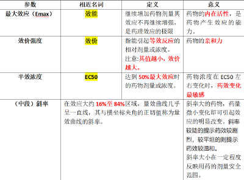
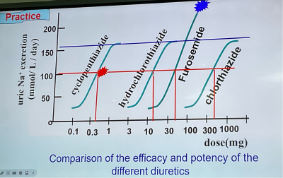

---
tags:
  - pharmacology
---
## 量反应

- ①形状： 直方双曲线（ 原形 ） or  S 型曲线（ 对数形 ）
- ②斜率（多取量效曲线中段）： 高斜率往往提示药物的药效剧烈、治疗窗较窄， “较小的药物剂量改变引起较大的效应变化 ”
>曲线越陡，人们用药的剂量差别越小、越相似；曲线越平缓，人与人之间用药起效的剂量个体差别越大。
-  <u>③最大效应/效能（maximal effect/efficacy, Emax）</u>  ：  ~~*随着剂量或浓度的增加，效应也增加；*~~ 当效应增加到一定程度后，若继续增加药物浓度或剂量，效应不再继续增强，这一药理效应的极限称为 最大效应或效能。
	- 药物的效能主要取决于药物的  内在活性  ：药物的特性、受配体亲和性
- ④半数最大效应浓度（EC50）： 量反应中能引起 50%最大效应的浓度
> 注意纵坐标投影也不在同一高度
-  <u>⑤效价强度（Potency Intensity）</u> 
	- 能 引起等效反应 （ *纵坐标投影同一高度，*  <u>一般</u> 为 50%效应量）的相对浓度或剂量。该剂量值越小，提示药物的效价强度越大。
	- 与药物的亲和性、药物与受体的结合有关。
	-  药物的最大效应与效价强度无关 
	  - hydrochlorothiazide  的效价强度大于 furosemide， 而后者的最大效应强于前者
			
> “药效有多强，和微量药物作用敏感度无关”
- ⑥个体差异性（Individual Variability）：相同剂量下不同个体的差异
- ⑦最小有效剂量/阈值剂量（minimal effective dose）：刚能引起效应的最小药物剂量或浓度
- ⑧极量（最大有效量）、最小中毒量、最小致死量

---
## 质反应

- ①形状： 频率分布直方图；对称 S 型曲线（累计频率）
- ②斜率： 人群差异性。斜率大表示人群差异性小
-  <u>③半数有效量（Median Effective Dose, ED50）：</u> 能引起  50%的实验动物（群体中半数个体） 出现 阳性 反应时的药物 剂量
- 区分：  半数最大效应浓度（EC50）： 量反应中能引起 50%最大效应的浓度
-  <u>④半数致死量（Median Lethal Dose, LD50）：</u> 能引起  50%的实验动物 死亡的药物剂量。 <mark style="background-color: #1A4F10; color: white">致死量越大，药物越安全 </mark>