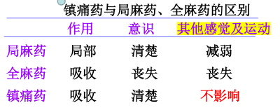
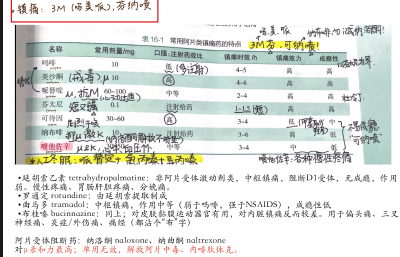

---
aliases:
  - Analgesics
---
#### 疼痛概述、分类
###### 疼痛分类：快痛、慢痛
  - 传导痛觉的<mark style="background-color: #1A4F10; color: white">快递质</mark>：[谷氨酸](Glu.md)。
  - 传导痛觉的<mark style="background-color: #1A4F10; color: white">慢递质</mark>：P物质（SP）
部位：躯体、内脏、神经痛。
## 一．镇痛药的概念、意义与分类。
- 概念：选择性作用于 中枢 （ 区别于解热镇痛药 ） ，提高痛阈、 同时可以 缓解疼痛引起的  不愉快情绪 ，又称为 中枢性镇痛药物
#### 镇痛药 vs 麻醉药

###### 特点
- 作用强大
- 不影响其他感觉和意识
-  易成瘾，  确诊前慎用。
###### 镇痛药分类
-  <u>阿片类</u> ：[吗啡](吗啡.md)（Morphine）、[可待因](Codeine.md)（Codeine，甲基吗啡）
- 人工合成镇痛药： [[美沙酮]]（Methadone） [[哌替啶]]（ Meperidine ） [[芬太尼]]（Fentanyl） [[纳布啡]]（Nalbuphine） [[喷他佐辛]]（Pentazocine）[[曲马多]] tramadol  [[布桂嗪]] bucinnazine
- 其它：[[延胡索乙素]] tetrahydropalmatine、[[罗通定]] rotundine
## 二．阿片生物碱

- 从阿片中提取的天然有镇痛作用的生物碱、部分合成的此类生物碱衍生物以及全合成的与之有类似作用的药物
#### 镇痛作用原理：
模拟内源性阿片肽，激动阿片受体。 
##### 阿片受体
激活后效应
- 均为GPCR
- 关闭突触前膜Ca2+通道， 抑制  钙内流引起释放的神经递质； 开放突触后膜K+通道， 抑制 冲动传导
> 积累一个小知识点：<mark style="background-color: #1A4F10; color: white"> 钙内流 </mark>引起释放的神经递质： 谷氨酸、P物质 、Ach、NE、5-HT
- 直接抑制神经元，减少<mark style="background-color:#fef3c7;"> 谷氨酸、P物质 </mark>（关键递质）、Ach、NE、5-HT释放
> 谷氨酸 link NMDA受体拮抗剂 美金刚（memantine）抗阿尔兹海默症
- 间接抑制痛觉通路中间神经元
###### 分布（书p22）
 中枢
- 痛觉区密度较高：脊髓胶质、丘脑内侧、中脑导水管周围
- 情绪精神区密度最高：边缘系统、蓝斑核（镇静）
- 神经内分泌控制
外周：肠黏膜下神经丛，引起便秘
-  μ、 δ、κ三种
- ① μ ： 介导吗啡典型作用： <u>镇痛</u> ，<u>镇静、呼吸抑制、缩瞳、欣快感、依赖性</u>
- ② κ：弱版的 μ， 主要介导脊髓镇痛效应，也能引起镇静作用；
- ③ δ：吗啡的 心肌保护作用 ；依赖性小； 镇痛效应不明显，主要调节激素 ；抗焦虑、抗抑郁
> link：吗啡对心脏不直接作用；扩张外周血管；治疗心绞痛心肌梗死。
###### 阻断剂
- 纳洛酮、纳曲酮
无法完全实现的选择性：[[内源性阿片肽]]的存在。

### （一）吗啡（Morphine）

- ### (二）可待因 / 甲基吗啡（Codeine）  (主要镇咳)77Y 
  - 体内过程：口服易吸收，生物利用度有60% （复方磷酸可待因——联邦止咳露）
  - 作用：镇痛、欣快、成瘾效应不如吗啡
	- 镇痛1/10，镇咳为1/4
	- 镇静不明显，欣快性和成瘾性弱；
  - 用途：中等程度的疼痛、无痰干咳；
  - 可致依赖性，不宜持续使用。
- # 三．人工合成镇痛药
- 基本结构和吗啡的相似性；最常用的吗啡代替品；均为阿片受体激动剂。
- <u>哌替啶（Pethidine)</u>   / 度冷丁（dolantin）
  - 作用：与吗啡相似，但自有特点
	- ① <u>镇痛（1/10）、镇静、呼吸抑制和平滑肌兴奋作用，比吗啡弱</u> ；无镇咳、止泻作用；
	- ②维持时间短（2~4h） 不影响产程，胎儿娩出前2~4h以上可用；
	-  ③ 成瘾性小 
	-  抗胆碱M受体，引发心动过速 
  - 应用
	- <mark style="background-color:#fef3c7;"> 最常用的吗啡代替品 </mark>，用于镇痛、心源性哮喘；
	- 分娩前2～4h可用
	- ②麻醉前给药、人工冬眠（哌替啶+氯丙嗪+异丙嗪）
- 其它镇痛药：关注【作用特点、临床应用、不良反应】
- 美沙酮  methadone：主要用来 戒毒 ，仍为较强效μ受体完全激动剂，成瘾性也很高。作用时间较吗啡长、副作用小。
-  芬太尼 fentanyl：短且强，吗啡镇痛的100倍。 不良弱。各种镇痛、麻醉辅助、透皮贴剂
- 可待因 codeine：甲基吗啡，作用、不良弱。中枢镇咳，剧烈干咳；与NSAIDS合用于中等疼痛。
-  喷他佐辛 pentazocine： 镇痛新，μ部分激动剂、κ完全激动剂，镇痛作用、成瘾性弱，是非麻醉管理药品。<mark style="background-color:#fef3c7;"> 不镇静，非麻醉管理药品 </mark>
  - 能提高血浆NA浓度，因此心血管作用与吗啡相反，加快心率、<mark style="background-color:#fef3c7;"> <u>升高血压</u> </mark>，冠心病不可用；对Oddi作用弱
  - 可用纳洛酮对抗精神副反应、呼吸抑制
- 罗通定 rotundine、延胡索乙素 tetrahydropalmatine： 非阿片受体激动剂类，中枢镇痛 ，阻断 D1受体 ，无成瘾，作用弱。慢性疼痛、胃肠肝胆疼痛、分娩痛。
> “妙不可言”
- <u>曲马多 tramadol：</u> 中枢镇痛，作用中等（弱于吗啡，强于NSAIDS），成瘾性低
- <u>布桂嗪 bucinnazine：</u> 同上；对皮肤黏膜运动器官有用，对内脏镇痛反而较差。用于偏头痛、三叉神经痛、炎症/外伤痛、痛经（都沾个“布”字）
-  二氢埃托啡 ：镇痛作用 最强 
- 四．阿片受体阻断药： <u>纳洛酮、</u> 纳曲酮
- 纳洛酮 naloxone、纳曲酮 naltrexone
- 对μ亲和力最高；不口服； 单用无效 ，解救阿片中毒、内啡肽休克。