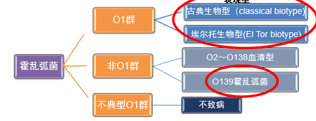

---
tags:
  - infection
---
霍乱是由霍乱弧菌引起的烈性肠道传染病，是我国甲类传染病
#### 病原学
霍乱弧菌是<mark style="background-color: #1A4F10; color: white">革兰阴性</mark>弧形或逗点状杆菌，<mark style="background-color: #1A4F10; color: white">无芽孢</mark>，仅 O139 型有荚膜，有鞭毛，运动活跃。
最适温度是 37℃，在碱性环境中生长较快 对热、干燥、酸性环境及消毒剂敏感。自然环境中存活时间较长。
含有菌体抗原“O”（特异性高、分群和型的基础）鞭毛抗原“H”（共有）
##### 霍乱弧菌的两种生物型和三种血清型
三种血清型：稻叶型（原型）小川型（异型）彦岛型（中间型）
两种生物型：古典生物型、埃尔托生物型
> 仅 O1 群和非 O1 群中的 O139 血清型才能引起霍乱

[Open: Pasted image 20260928091549.png](attachments/a13e8ef4492bff64834804f5621bcadf_MD5.jpg)

#### 流行病学
1817 年以来七次霍乱大流行：
- 1-5：古典生物型 
- 6：El Tor 生物型 
- 7：El Tor+O139
地方性：存在地方性疫源地（古典型 印度恒河三角洲 El Tor 型 苏拉威西岛） 我国沿海。
季节性：夏秋季，以 7-10 月为多
周期性：国内无明显周期性
##### 传染源、传播途径和易感人群
传染源：带菌者；病人（排菌时间<mark style="background-color: #1A4F10; color: white">5 d，最长 2 周</mark>；重型病人排菌量大，是重要传染源）
传播途径：<mark style="background-color: #1A4F10; color: white">粪口</mark>传播（水、食物、苍蝇、生活接触）
易感人群：普遍易感
#### 发病机制和病理变化
发病取决于自身免疫力（胃酸分泌）、霍乱弧菌的入侵数量及致病力（毒素协同调节菌毛 TcpA—定居；<mark style="background-color: #1A4F10; color: white">霍乱肠毒素（CT）</mark>）
##### 发病过程：
霍乱弧菌突破胃酸屏障进入小肠➡️穿过肠黏膜的肠黏液层（鞭毛+蛋白酶）➡️黏附于小肠上段的黏膜上皮细胞（TcpA+血凝素）（不侵及肠黏膜下层）➡️小肠碱性环境中大量繁殖，产生霍乱肠毒素引起小肠粘膜功能失调（致病关键）
<mark style="background-color: #1A4F10; color: white">肠毒素</mark>：A1 亚单位促进细胞内 cAMP 大量产生➡️刺激肠黏膜隐窝细胞分泌水、氯化物和碳酸盐并抑制绒膜细胞吸收钠和氯离子➡️水和 NaCl在肠腔积聚➡️<mark style="background-color: #1A4F10; color: white">米泔水样便</mark>（等渗高钾高碳酸氢盐）、水和电解质紊乱、酸中毒
##### 病理变化：
- 严重脱水表现（皮肤干燥、皮下组织肌肉干瘪、实质脏器缩小）；
- 脏器实质损害轻；
- 小肠明显水肿
#### 临床表现
<mark style="background-color: #705A16; color: white">潜伏期</mark>：一般为 1-3 天，分为轻型、中型、重型和爆发性（中毒型/干性霍乱）
<mark style="background-color: #705A16; color: white">泻吐期</mark>：剧烈[腹泻](腹泻.md)：量多次频，粪臭不明显，少有腹痛（O139 型除外）；无里急后重，<mark style="background-color: #1A4F10; color: white">“米泔水”样便</mark>；剧烈[呕吐](呕吐.md)（喷射性，不伴恶心，吐“米泔水”样）
<mark style="background-color: #705A16; color: white">脱水期</mark>：脱水（霍乱[面容](面容.md)、循环衰竭、洗衣工手、舟状腹）；肌肉痉挛（腹直肌和腓肠肌明显）；低血钾（肌张力下降、腱反射消失、鼓肠、心律失常）；[尿毒症](尿毒症.md)、酸中毒（呼吸加快伴意识障碍）；循环衰竭：低血容量性[休克](休克.md)
<mark style="background-color: #705A16; color: white">恢复期</mark>：脱水纠正，症状消失，体温上升（内毒素入血，1-3 d 自行消退）

