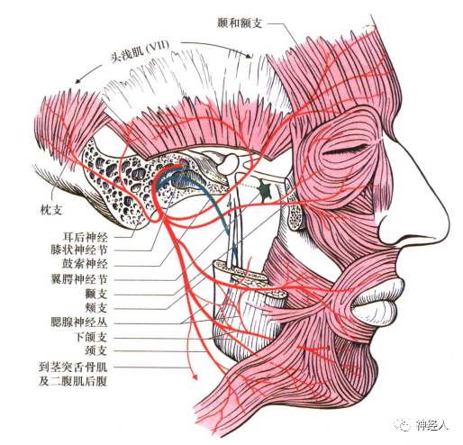
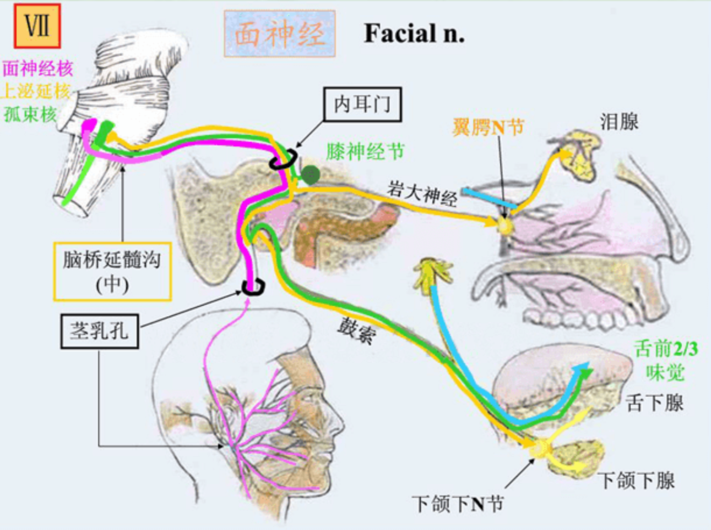

---
aliases:
  - CNVII
tags:
  - Neurology
---
### 解剖生理
支配面上部各肌之神经元接受双侧[皮质延髓束](皮质核束.md)的控制
支配<mark style="background-color: #705A16; color: white">面下部</mark>各肌之神经元单独接受<mark style="background-color: #1A4F10; color: white">对侧</mark>皮质延髓束控制
[Open: Pasted image 20260926174754.png](attachments/a98e4f466e7f3e31ca2678059b625514_MD5.jpg)

| 纤维成分        | 功能  | 具体支配/传导                                                                                                                                            |
| ----------- | --- | -------------------------------------------------------------------------------------------------------------------------------------------------- |
| 特殊内脏运动      | 运动  | 支配<mark style="background-color: #1A4F10; color: white">面部表情肌</mark>、镫骨肌、二腹肌后腹、茎突舌骨肌                                                               |
| 一般内脏运动（副交感） | 分泌  | 支配泪腺、下颌下腺、舌下腺、鼻腔和腭部腺体                                                                                                                              |
| 特殊内脏感觉（味觉）  | 感觉  | 传导<mark style="background-color: #1A4F10; color: white">舌前2/3味觉</mark>（通过鼓索神经） |
| 一般躯体感觉      | 感觉  | 传导外耳道、耳廓皮肤的一般感觉                                                                                                                                    |
[Open: Pasted image 20260926174834.png](attachments/5b198cdf77b0a6769473949a9d84fc85_MD5.jpg)

### 临床症状
#### 检查
观察患者口角歪斜（面部表情肌）
皱眉 皱额  抵抗阻力闭眼  鼓腮  示齿
味觉：舌<mark style="background-color: #1A4F10; color: white">前2/3</mark>味觉  每试一种后温水漱口
#### 分类
###### 周围性面神经麻痹：
病侧全部表情肌瘫痪，即患侧额纹变浅或消失、眼裂变大、闭眼无力、鼻唇沟变浅，示齿口角偏向健侧
即核下瘫：整个对侧表情肌麻痹
###### 中枢性面神经麻痹：
对侧下部表情肌瘫痪，即鼻唇沟变浅口角下垂，示齿口角偏向健侧，不能鼓腮，患侧口角流涎。
即<mark style="background-color: #1A4F10; color: white">核上瘫：对侧睑裂以下</mark>（<mark style="background-color: #3F4B5E; color: white">眼角以下</mark>）表情肌麻痹  睑裂以上肌肉不受影响。
